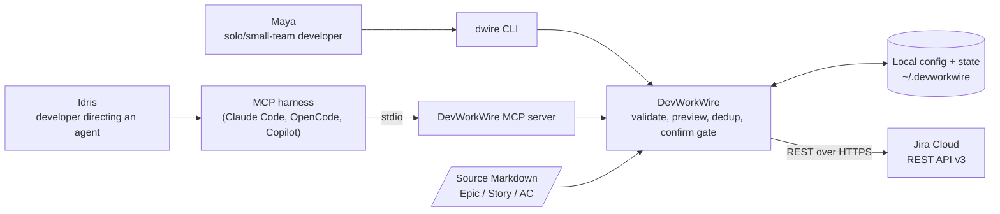
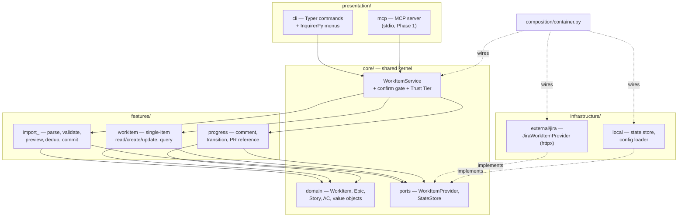

# Architecture Solution Design

| Attribute        | Value                       |
| ---------------- | --------------------------- |
| **Project**      | DevWorkWire                 |
| **Version**      | 0.1                         |
| **Status**       | Draft                       |

## Table of Contents

- [System Context](#system-context)
- [Architectural Approach](#architectural-approach)
- [Component Design](#component-design)
- [Data Flow](#data-flow)
- [Integration Points](#integration-points)
- [Observability](#observability)
- [Deployment Impact](#deployment-impact)
- [Security Considerations](#security-considerations)
- [Scalability Considerations](#scalability-considerations)
- [Trade-offs and Alternatives](#trade-offs-and-alternatives)
- [ADR Reference](#adr-reference)
- [Source References](#source-references)

## System Context

DevWorkWire is a **locally installed Python package**, not a hosted service. It runs
entirely on the user's machine and holds no server, no network listener, and no
multi-user state. Its boundary contains the parsing, validation, preview, dedup, and
confirm-gate logic; everything durable about the work items themselves lives in the
external tracker.

Two front doors reach that boundary, and both go through the same core service:

- **`dwire` CLI** — driven directly by the developer ([F-003](../../01-requirements/f-003-cli-dwire-flow.md)).
- **MCP server** — driven by the developer's AI agent through any MCP-compatible harness
  ([F-004](../../01-requirements/f-004-mcp-tool-surface.md)), launched as a local
  subprocess over stdio.

**Out of the boundary:** interpreting free-form text into structure, and creating pull
requests — both excluded per [Out of Scope for MVP](../../00-context/out-of-scope.md).
DevWorkWire only *records* a PR reference supplied to it
([FR-007-03](../../01-requirements/f-007-progress-reporting.md)).

## Architectural Approach

**Hexagonal (Ports & Adapters), organized as vertical feature slices over a shared
kernel, shipped as one distributable Python package.**

Hexagonal is not a stylistic preference here — it is what makes the stated Phase 2 goal
achievable: adding Linear and Azure DevOps adapters behind the existing
`WorkItemProvider` port with no change to the core service, the CLI, or the MCP tool
definitions ([Overview → Technical Goals](../../00-context/overview.md#technical-goals)).

The full style evaluation lives in [Architecture Styles](./architecture-styles.md).

### Key Design Principles

- **One core service, two front doors.** `WorkItemService` and the confirm gate live in
  the shared kernel, never inside a feature slice. The CLI and the MCP server are both
  thin presentation adapters over it, which is what
  [FR-004-01](../../01-requirements/f-004-mcp-tool-surface.md) means by "no divergent
  logic path".
- **The domain never imports an adapter.** Dependencies point inward: presentation →
  feature use cases → shared kernel → ports. Jira types never cross the port boundary;
  the adapter maps them to domain types at the edge.
- **Externally-visible writes are gated, structurally.** The confirm gate is a property
  of the core service, not of a caller. There is no parameter, tool, or flag that skips
  it ([FR-004-03](../../01-requirements/f-004-mcp-tool-surface.md)).
- **Read is free, write is gated.** The Trust Tier split from the
  [Glossary](../../00-context/glossary.md#technical-terms) is enforced in one place:
  read-only operations (search, query, fetch) run autonomously; comment, transition, and
  commit do not.
- **Preview is a pure computation.** Generating a preview performs zero writes
  ([NFR-001-01](../../01-requirements/f-001-validate-preview-commit.md)), which is what
  makes it safe for an agent to call freely.

## Component Design

Feature slices own their own entities, use cases, DTOs, and provider mapping. What they
do **not** own is the confirm gate — that stays in the shared kernel so both front doors
and every slice inherit the same behavior.

| Component | Responsibility | Key interfaces |
| --------- | -------------- | -------------- |
| `presentation/cli` | Renders the guided flow, prompts for confirmation, formats preview output for an 80-column terminal ([NFR-003-01](../../01-requirements/f-003-cli-dwire-flow.md)). Holds no business rules. | Typer commands; calls `WorkItemService` |
| `presentation/mcp` | Exposes `import.preview` / `import.commit` and the read-only query tools as MCP tools; marshals arguments and results. Holds no business rules. | MCP tool schemas; calls `WorkItemService` |
| `core/WorkItemService` | The single entry point both front doors use. Classifies each operation by Trust Tier and enforces the confirm gate before dispatching to a slice's use case. | Called by presentation; calls feature use cases |
| `core/domain` | Provider-neutral work-item model and invariants. No Jira vocabulary, no I/O. | Pure types |
| `core/ports` | `WorkItemProvider` (tracker read/write) and `StateStore` (local import references, drift baselines, idempotency keys). | Protocols implemented by `infrastructure/` |
| `features/import_` | Markdown parsing, structural validation, preview construction, dedup matching and drift detection, fail-fast batch commit. Covers [F-001](../../01-requirements/f-001-validate-preview-commit.md) and [F-002](../../01-requirements/f-002-dedup-on-rerun.md). | Use cases invoked by `WorkItemService` |
| `features/workitem` | Single-item create/read/update without a full re-import, plus status/assignee-filtered queries. Covers [F-005](../../01-requirements/f-005-work-item-crud.md) and [F-006](../../01-requirements/f-006-mcp-work-context-query.md). | Use cases invoked by `WorkItemService` |
| `features/progress` | Comments, status transitions, and PR-reference writes. Covers [F-007](../../01-requirements/f-007-progress-reporting.md). | Use cases invoked by `WorkItemService` |
| `infrastructure/external/jira` | The only module that knows Jira exists: REST v3 calls over `httpx`, field mapping, retry/backoff, error translation. | Implements `WorkItemProvider` |
| `infrastructure/local` | Config loading and validation ([F-008](../../01-requirements/f-008-provider-auth-configuration.md)), and the local state store. | Implements `StateStore` |
| `composition/container.py` | The composition root. The only place concrete adapters are constructed and injected. | Wires everything for both entry points |

## Data Flow

The primary flow is the validate → preview → confirm → commit import
([F-001](../../01-requirements/f-001-validate-preview-commit.md)). It is identical from
either front door; only the confirmation mechanism differs (a terminal yes/no prompt vs.
an explicit confirmation argument on `import.commit`).

1. **Load and parse.** The source Markdown is read from disk and parsed into the domain
   structure — H1 Epic, H2 Story, bullet-list Acceptance Criteria.
2. **Validate.** Structural checks run on the parsed tree: required fields, parent/child
   resolution, orphan detection, declared-count matching. Failure halts here with
   item-identifying errors and no preview.
3. **Match and classify.** For each item, the state store is consulted for a stored
   import-source reference. Matched items are read back from Jira and compared against
   the baseline recorded at last import to detect drift
   ([FR-002-03](../../01-requirements/f-002-dedup-on-rerun.md)). Each item is classified
   `create`, `update`, or `update (drifted)`.
4. **Preview.** The classification is rendered. **Zero writes have occurred** — reads
   only.
5. **Confirm.** The gate. Drifted items each carry an explicit overwrite-or-skip choice
   ([FR-002-04](../../01-requirements/f-002-dedup-on-rerun.md)). Declining produces zero
   writes.
6. **Commit.** Approved items are written through `WorkItemProvider` in order, Epics
   before their Stories. On a write failure the batch stops immediately (fail-fast): items
   already written stay written, and the result separates committed, failed, and untried
   items ([FR-001-06](../../01-requirements/f-001-validate-preview-commit.md)).
7. **Record.** For each successful write, the import-source reference and the new drift
   baseline are persisted, so the next run matches instead of duplicating.

Because step 7 runs per item rather than per batch, a fail-fast stop in step 6 leaves a
consistent, resumable state: re-running the same document matches the already-committed
items and retries only the remainder.

Detailed step-by-step interactions are drawn in
[Sequence Diagrams](../diagrams/sequence-diagrams.md).

## Integration Points

| Integration | Type | Direction | Notes |
| ----------- | ---- | --------- | ----- |
| Jira Cloud REST API v3 | REST/HTTPS | Outbound | Authenticated with the user's own API token via `Authorization: Basic` (email + token), read from an environment variable ([FR-008-02](../../01-requirements/f-008-provider-auth-configuration.md)). Expect 401 (bad token), 403 (project permissions), 404 (issue/project), and 429 (rate limit) as normal failures needing actionable messages, not stack traces. |
| MCP harness | JSON-RPC over stdio | Inbound | The harness spawns the server as a local subprocess. No network listener, no port, no inbound auth surface. Phase 1. |
| Local filesystem — source document | File read | Inbound | User-supplied Markdown path. Read-only; DevWorkWire never rewrites the source. |
| Local filesystem — config and state | File read/write | Bidirectional | YAML config (non-secret) plus the local state store. Never contains the API token. |

## Observability

DevWorkWire runs on a user's machine, so observability means **local diagnosability**,
not a hosted telemetry pipeline. There is no metrics backend, no error-tracking SaaS, and
no phone-home — anything else would be inappropriate for a local open-source developer
tool handling a user's tracker credentials.

- **Error surfacing:** failures are reported to the user at the point of use with the
  offending item identified. Jira API errors are translated into actionable messages
  (which field, which issue, which permission) rather than raw HTTP dumps.
- **Structured logging:** logs go to stderr so they never corrupt MCP's stdio protocol
  channel on stdout. A verbosity flag raises detail for troubleshooting.
- **Redaction is mandatory:** the API token and `Authorization` header value are never
  logged at any verbosity ([NFR-008-01](../../01-requirements/f-008-provider-auth-configuration.md),
  [NFR-X01](../../01-requirements/README.md#cross-cutting-quality-baseline)).
- **Key signals:** validation failure counts by reason, commit outcome per item, drift
  detections, and Jira 429/5xx retry counts — all surfaced to the user, not exported.

Details and the release-health approach are in
[Monitoring and Observability](../ops/monitoring-observability.md).

## Deployment Impact

- **One deployable unit.** A single `devworkwire` package installed with pipx/pip or a
  Homebrew tap ([F-009](../../01-requirements/f-009-packaging-distribution.md)). No
  containers, no servers, no infrastructure to provision, no environments to keep in sync.
- **The user's machine is the deployment target.** "Rollback" means installing a previous
  version; "the production environment" is whatever Python the user has, which is why the
  3.11 floor and a clean-install check per release
  ([NFR-009-01](../../01-requirements/f-009-packaging-distribution.md)) matter more than
  they would for a hosted service.
- **The MCP server is not separately deployed.** It ships in the same package and is
  spawned by the harness, so it has no independent release cadence.
- **Local state has no migration infrastructure.** Any schema evolution in the state store
  must be handled in-process on startup — there is no operator to run a migration tool.
  See [Database Design](../database/database-design.md).

## Security Considerations

The security properties this design must preserve, in full detail in
[Security Architecture](../security/security-architecture.md) and
[Threat Model](../security/threat-model.md):

- **The confirm gate is a security control, not a UX affordance.** It is the single
  mechanism preventing an AI agent from making unreviewed, externally-visible changes to a
  real backlog. It belongs in the core service precisely so no front door can route around
  it.
- **The token never touches disk.** It is read from the environment at run time and lives
  only in process memory ([NFR-008-01](../../01-requirements/f-008-provider-auth-configuration.md)).
- **DevWorkWire has exactly the permissions the user's own token has.** There is no
  service account and no privilege of its own, which bounds the blast radius of any
  compromise to what that user could already do in Jira.
- **The source document is untrusted input.** It may come from an agent. Parsing and
  validation must fail safely on malformed or hostile input rather than producing partial
  writes.
- **No inbound network surface.** stdio-only MCP means no listening port to attack.

## Scalability Considerations

The scalability and performance NFRs
([NFR-X04](../../01-requirements/README.md#cross-cutting-quality-baseline),
`NFR-X05`) are still **Draft** with `TBD` targets, so this section states the shape of the
load rather than committing to numbers.

- **Load is single-user and interactive.** One person or one agent, one document at a
  time. There is no concurrency model to design and no shared-resource contention.
- **The real bound is Jira's API, not DevWorkWire.** A commit is N sequential REST calls
  for N items; a 5-epic / 20-story document is ~25 calls. Wall-clock time is dominated by
  Jira round-trips and its rate limits, which is where retry-with-backoff matters and
  where any future optimization (batching, concurrency) would have to go.
- **Bounded by design scope.** One configuration targets exactly one Jira project
  ([FR-008-04](../../01-requirements/f-008-provider-auth-configuration.md)), which caps
  the working set at what a single project holds.
- **What would need to change at much larger scale:** streaming the parse rather than
  holding the whole document in memory, and bounded-concurrency commits with per-item
  rather than fail-fast error handling. Neither is warranted until `NFR-X04`/`NFR-X05` have
  real targets.

## Trade-offs and Alternatives

| Option | Pros | Cons | Verdict |
| ------ | ---- | ---- | ------- |
| Hexagonal + vertical feature slices, one package | Provider swap is a Phase 2 non-event; feature code stays co-located and readable; single artifact to ship and install | Slicing tempts each slice toward its own confirm/write path, which would break [FR-004-01](../../01-requirements/f-004-mcp-tool-surface.md); more indirection than a small tool strictly needs | **Selected** — the slicing risk is contained by keeping `WorkItemService` and the confirm gate in the shared kernel |
| Hexagonal + strict layering (no slices) | Hardest to accidentally duplicate the gate; conventional and immediately legible to a new contributor | Feature code scatters across four layer directories, so a single change touches four distant folders | Rejected — co-location was judged worth more than the extra guard, given the gate is already centralized |
| Direct Jira calls from CLI/MCP, no port | Least code for the Jira-only MVP | Phase 2 (Linear, Azure DevOps) becomes a rewrite; Jira types leak into every layer; the core becomes untestable without network mocking, defeating [NFR-X03](../../01-requirements/README.md#cross-cutting-quality-baseline) | Rejected — contradicts a stated technical goal |
| Separate CLI and MCP codebases | Each front door optimized independently | Two confirm gates to keep honest, which is exactly the "looser agent path" the project exists to avoid ([Key Differentiators](../../00-context/overview.md#key-differentiators)) | Rejected — defeats the product's central claim |
| Client/server: local daemon, thin CLI | Shared session state; a remote MCP endpoint becomes possible | A background daemon holding tracker credentials, plus a network surface, on a developer's machine — large security and support cost for no MVP benefit | Rejected — no requirement justifies it |

**Accepted risk:** vertical slicing makes it structurally *possible* for a future slice to
call `WorkItemProvider` directly and skip the gate. Mitigation: the gate lives in the
shared kernel, slice use cases are only reachable through `WorkItemService`, and an
architecture guard in CI should assert that nothing under `presentation/` imports
`infrastructure/` and that no slice calls a write method on `WorkItemProvider` outside a
gated use case. See [Quality Gates](../ops/ci-cd-pipeline.md).

## ADR Reference

The decisions recorded on this page and in [Technology Stack](./technology-stack.md) are
captured in [04-decisions](../../04-decisions/README.md). All ten are currently **Proposed**
— promote each to Accepted as its Phase 0 / MVP implementation confirms it.

| ADR | Decision | Also recorded in |
| --- | -------- | ---------------- |
| [ADR-001](../../04-decisions/adr-001-hexagonal-vertical-slices.md) | Hexagonal architecture with vertical feature slices, single package | This document, [Architecture Styles](./architecture-styles.md) |
| [ADR-002](../../04-decisions/adr-002-python-runtime-cli-platforms.md) | Python 3.11+ baseline; Typer + InquirerPy CLI; supported platforms | [Technology Stack](./technology-stack.md) |
| [ADR-003](../../04-decisions/adr-003-jira-rest-httpx.md) | Jira access via direct REST v3 over `httpx` | [Technology Stack](./technology-stack.md) |
| [ADR-004](../../04-decisions/adr-004-mcp-stdio-confirm-gate.md) | MCP server on stdio only, with the preview-handle confirm gate | [Interface Design Standards](../interfaces/interface-standards.md) |
| [ADR-005](../../04-decisions/adr-005-local-sqlite-state-store.md) | Local SQLite state store as a rebuildable cache | [Database Design](../database/database-design.md) |
| [ADR-006](../../04-decisions/adr-006-config-and-secrets.md) | Per-project YAML config + environment-variable secret | [Security Architecture](../security/security-architecture.md) |
| [ADR-007](../../04-decisions/adr-007-packaging-and-release.md) | Hatchling build backend; PyPI/pipx/Homebrew distribution; Trusted Publishing | [Deployment Architecture](../ops/deployment-architecture.md) |
| [ADR-008](../../04-decisions/adr-008-quality-toolchain-github-actions.md) | Quality and security toolchain on GitHub Actions | [CI/CD Pipeline](../ops/ci-cd-pipeline.md) |
| [ADR-009](../../04-decisions/adr-009-no-telemetry.md) | No telemetry; local diagnosability only | [Monitoring and Observability](../ops/monitoring-observability.md) |
| [ADR-010](../../04-decisions/adr-010-git-workflow-branch-strategy.md) | Two-branch fork-based workflow, CI as the merge gate | [CI/CD Pipeline](../ops/ci-cd-pipeline.md) |

## Source References

- [Architecture Styles](./architecture-styles.md)
- [Technology Stack](./technology-stack.md)
- [Feature Requirements](../../01-requirements/README.md)
- [Project Overview](../../00-context/overview.md)
- [Glossary](../../00-context/glossary.md)
- [Phased Roadmap](../../02-planning/phased-roadmap.md)

---

**Last Updated**: 2026-08-31
