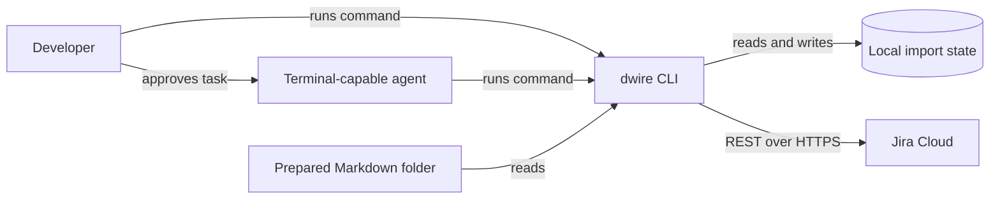
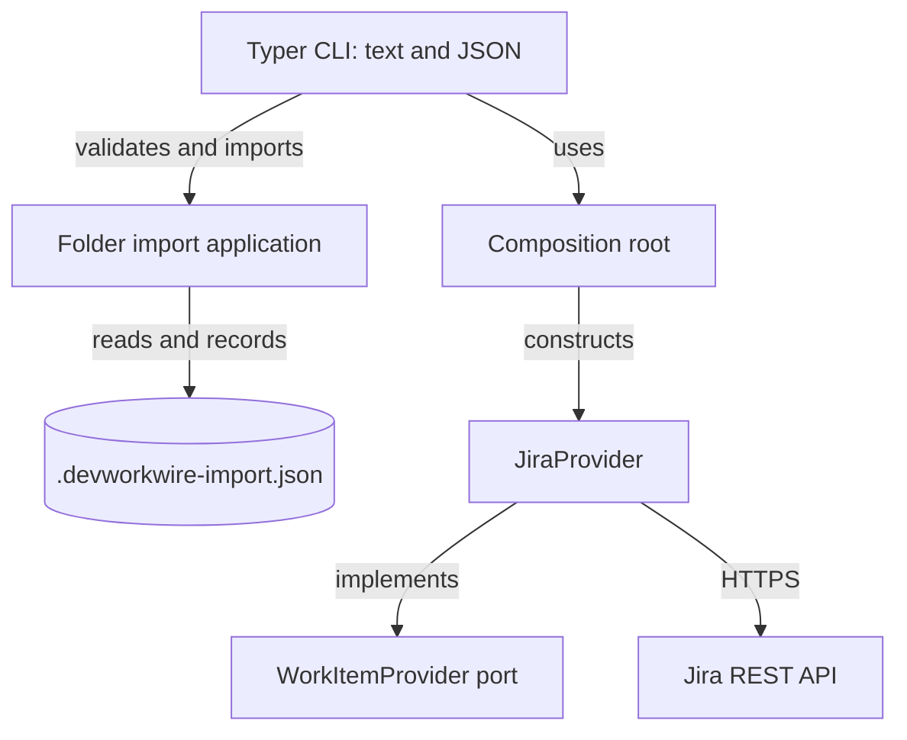

# Architecture solution design

DevWorkWire is a local Python CLI. Its current composition root provides a
Jira adapter behind the `WorkItemProvider` port. People and terminal-capable
agents invoke the same direct commands; a portable skill supplies agent
workflow guidance. This page describes shipped behavior. See
[ADR-011](../../04-decisions/adr-011-cli-first-agent-integration.md) for the
interface decision.

## System context

There is no current MCP server, network listener, or server database. The
agent's host controls its shell access. The CLI cannot inspect the user's
conversation with the agent.

## Architectural approach

The current code uses domain entities, a provider port, a Jira adapter, and a
composition root. The CLI invokes the provider through that root. Folder
preview and import logic are local application functions, with a JSON resume
file in the source folder. Earlier documents proposed a shared
`WorkItemService`, SQLite preview plans, and two front doors; those components
are not implemented in the current baseline.

## Component design

`dwire --format json` returns one result object on stdout for a direct
command. Logs and diagnostics use stderr. The interactive menu remains text.
The [interface contract](../interfaces/interface-contract.md) lists current
commands, outcomes, and write behavior.

## Data flow

A folder preview parses `epic.md` and optional `stories.md`, validates their
structure, and compares them with the local resume record. It makes no Jira
write. An import repeats the local preview under a folder lock, requires an
interactive confirmation or `--yes`, then creates missing issues and records
keys. Re-runs skip recorded items. They do not update changed uploaded items.

Direct create commands write one issue immediately and return its key. A Jira
response with an uncertain outcome during import leaves a pending local record
for manual resolution before retrying.

## Security considerations

A user-approved agent task authorizes the agent's writes. The skill instructs
agents to inspect folder previews and stop on uncertain or partial outcomes,
but these instructions are not a CLI-enforced approval gate. Treat source
Markdown and Jira text returned to an agent as untrusted data. See
[Security Architecture](../security/security-architecture.md).

## Scalability considerations

The current CLI operates on one configured Jira project and one source folder
per import. The provider's list operations page through Jira results. No
multi-user server or distributed state is present.

## Future work

Search, updates, richer queries, progress reporting, and other providers
remain planned. MCP is deferred pending a specific client requirement. Each
future write operation needs an explicit retry and recovery design.
