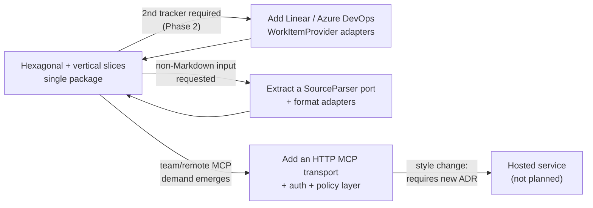

# Architecture Styles

| Attribute        | Value                       |
| ---------------- | --------------------------- |
| **Project**      | DevWorkWire                 |
| **Version**      | 0.1                         |
| **Status**       | Draft                       |

## Table of Contents

- [Decision Summary](#decision-summary)
- [Architecture Style Evaluation](#architecture-style-evaluation)
- [Bounded Context Alignment](#bounded-context-alignment)
- [Rationale and Trade-offs](#rationale-and-trade-offs)
- [Evolution Strategy](#evolution-strategy)
- [Scalability Alignment](#scalability-alignment)
- [Source References](#source-references)

## Decision Summary

**Selected style:** Hexagonal (Ports & Adapters) with vertical feature slices, shipped as
a single distributable Python package. Slices are **internally layered** — each owns its
`application/` and `presentation/` — while the domain model, the ports, the confirm gate,
and the provider adapter stay in a shared kernel. See
[Where the conventional layers live](#where-the-conventional-layers-live).
**Linked ADR:** [ADR-001 — Hexagonal Architecture with Vertical Feature Slices](../../04-decisions/adr-001-hexagonal-vertical-slices.md) (Proposed).

The dominant constraint is **a single part-time developer** (see
[Role Mapping](../../02-planning/role-mapping.md) and the single-developer bandwidth risk
in the [Phased Roadmap](../../02-planning/phased-roadmap.md)) building toward a stated
Phase 2 goal of adding Linear and Azure DevOps adapters *without touching the core*. That
combination rules out both extremes: no time for ceremony that buys nothing today, but
no tolerance for a Jira-coupled core that would make Phase 2 a rewrite. Hexagonal with a
single `WorkItemProvider` port is the minimum structure that makes the provider swap a
non-event; vertical slicing keeps each feature's code in one place so a solo developer
isn't navigating four layer directories to change one behavior.

## Architecture Style Evaluation

| Criterion | Flat single-module CLI | Layered hexagonal | **Hexagonal + vertical slices** | Local daemon + thin client |
| --------- | ---------------------- | ----------------- | ------------------------------- | -------------------------- |
| Solo-developer fit | Best short-term — no structure to maintain | Good, but a one-line change spans four directories | **Best sustained — feature code is co-located, structure is only as deep as the port boundary** | Poor — a background service to build, ship, debug, and support alone |
| Time to MVP | Fastest to first commit, slowest by F-003 as coupling accumulates | Slightly slower than slices | **Fast — slice boundaries follow the feature docs (F-001…F-007) directly** | Slowest by a wide margin |
| Provider swap cost (Phase 2) | Prohibitive — Jira calls scattered everywhere | Low — one port, one adapter | **Low — identical port isolation** | Low, but irrelevant given the other costs |
| Enforcing one confirm gate | Poor — nothing prevents a second write path | **Best — layering makes a bypass conspicuous** | Adequate — requires the gate to stay in the shared kernel, plus a CI guard | Adequate |
| Testability (`NFR-X03`, ≥80%) | Poor — logic inseparable from I/O and terminal | Good — ports mock cleanly | **Good — identical port isolation; slices test as units** | Poor — needs process orchestration in tests |
| Operational complexity | None | None | **None — still one package, one process** | High — lifecycle, ports, stale-daemon failures, credentials at rest |
| Security surface | Small | Small | **Small — no listener** | Large — a long-lived process holding tracker credentials |
| Evolution path | Dead end; rewrite required | Clean | **Clean — new provider = new adapter; new feature = new slice** | Enables remote MCP, which no requirement asks for |

**Why hexagonal + vertical slices wins:** it is the only candidate that scores well on
*both* axes that matter — provider-swap cost (the Phase 2 goal) and solo-developer
ergonomics (the top project risk) — while adding no operational or security surface. Its
one weakness, a structurally possible second write path, is a known, cheaply mitigated
problem; the flat option's weaknesses are not fixable without a rewrite, and the daemon
option pays real security and support cost for capability nothing requires.

## Bounded Context Alignment

Contexts map one-to-one onto the feature slices, with a shared kernel holding what must
not be duplicated. All dependencies point inward toward the kernel; no slice depends on
another slice.

This table is the **dependency map** — what each context may import. Full per-module
responsibilities and interfaces are in
[Component Design](./architecture-solution-design.md#component-design); the feature docs
each context implements are named there.

| Bounded Context | Module/Package | Depends On |
| --------------- | -------------- | ---------- |
| Work Item Model (shared kernel) | `core/domain` | — (depends on nothing) |
| Provider Contract (shared kernel) | `core/ports` | `core/domain` |
| Trust & Orchestration (shared kernel) | `core/service.py` — `WorkItemService`, confirm gate | `core/domain`, `core/ports` |
| Document Loading | `features/import_/application` | `core/*` |
| Document Loading — front doors | `features/import_/presentation` | own `application`, `core/*`, `presentation/*` |
| Work Item Access | `features/workitem/application` | `core/*` |
| Work Item Access — front doors | `features/workitem/presentation` | own `application`, `core/*`, `presentation/*` |
| Progress Reporting | `features/progress/application` | `core/*` |
| Progress Reporting — front doors | `features/progress/presentation` | own `application`, `core/*`, `presentation/*` |
| Tracker Integration | `infrastructure/external/jira` | `core/ports`, `core/domain` |
| Local Persistence & Config | `infrastructure/local` | `core/ports` |
| Front-Door Hosts | `presentation/cli`, `presentation/mcp` | `core/*` only |
| Composition Root | `composition` | Everything |

**Invariants to enforce.** All are mechanically checkable and belong in CI (see
[CI/CD Pipeline](../ops/ci-cd-pipeline.md)):

- No `presentation/` package — the shared hosts *or* a feature's own — may import
  `infrastructure/`.
- No feature's `application/` may import another feature, `infrastructure/`, or any
  `presentation/`.
- `composition/` is the only package permitted to import everything.

### Where the conventional layers live

Slices are **internally layered**, so the familiar four layers are all present — but three
of them are distributed by feature rather than collected into one directory each. There is
no top-level `application/` folder, and that is the decision, not an omission: a directory
per layer is exactly the "layered hexagonal" candidate rejected above.

| Conventional layer | Where it lives here |
| ------------------ | ------------------- |
| Domain | `core/domain` — one model, shared. `import_` creates it, `workitem` updates it, `progress` comments on it, so splitting it per feature would duplicate it or leave it hollow. |
| Application | **Split by role.** Cross-cutting orchestration — `WorkItemService` and the confirm gate — is `core/service.py`; the use cases themselves are `features/*/application`. |
| Infrastructure | `infrastructure/external/jira` and `infrastructure/local` — deliberately *not* per feature, so Jira knowledge stays in one place and a Phase 2 provider is one new file rather than three. |
| Presentation | **Split by role.** The two hosts and the shared rendering conventions are `presentation/cli` and `presentation/mcp`; each feature's own commands and tool schemas are `features/*/presentation`. |

The two layers that stay whole — domain and infrastructure — are the two the slices have no
reason to own separately. The two that split — application and presentation — are where
feature cohesion actually pays.

## Rationale and Trade-offs

The full consequences of this choice — five benefits and four accepted risks, each with
its mitigation — are recorded in
[ADR-001 § Consequences](../../04-decisions/adr-001-hexagonal-vertical-slices.md#consequences)
and are not repeated here. What the evaluation above adds is *why this candidate rather
than the others*:

- **It is the only option strong on both deciding axes at once.** Provider-swap cost
  (the Phase 2 goal) and solo-developer ergonomics (the top project risk) are usually
  traded against each other — the flat CLI wins the second and loses the first, layering
  wins the first at a navigation cost paid on every change. Slices over a port win both.
- **Its one weakness is cheap to contain; its rivals' are not.** The structurally possible
  ungated write path is fixed by keeping the gate in the shared kernel and asserting it in
  CI. The flat option's coupling and the daemon option's security surface are not fixable
  without abandoning the choice.
- **It adds nothing operationally.** Unlike the daemon, it buys its evolution path without
  a process to run, a credential at rest, or a listener to defend.

## Evolution Strategy

DevWorkWire evolves by **adding adapters and slices**, not by splitting the deployable.
The realistic pressures are a second tracker, a second input format, and remote MCP
hosting — the first two are absorbed by the existing structure; only the third would
change the style, and nothing currently asks for it.

### Trigger-based extraction criteria

- **A second `WorkItemProvider` is needed** (planned, Phase 2) — no structural change;
  add an adapter and a config field selecting it. If this turns out to require changing
  the port, the port was wrong, and the ADR should record why.
- **A non-Markdown source format is requested** — parsing is currently internal to
  `features/import_`. Extract a `SourceParser` port only when a second format actually
  arrives, not in anticipation of one.
- **Remote/multi-user MCP demand emerges** — this is the only genuine style change: it
  introduces a network listener, inbound authentication, and the policy layer deliberately
  deferred in [Out of Scope](../../00-context/out-of-scope.md#governance-phase-4-only-if-demand-emerges).
  It requires a new ADR and a fresh threat model; do not drift into it incrementally.
- **The state store outgrows local files** — only relevant if state must be shared across
  machines or users, which is the same trigger as above.

### Migration path

The order below matters: the port must be proven by a real second implementation before
anything is built on the assumption that it generalizes.

1. **Phase 0 — harden the boundaries.** Stand up the skeleton with `WorkItemProvider` and
   `StateStore` defined and the composition root wiring them, before any feature logic
   exists. Add the CI architecture guard at the same time, while there is nothing to fix.
2. **MVP — prove the port with one adapter.** Build the Jira adapter and keep every Jira
   concept behind it. Any Jira vocabulary that leaks into `core/` or `features/` is a
   defect, not a shortcut.
3. **Phase 2 — validate with a second adapter.** Implement Linear against the unchanged
   port. This is the real test of the design; the ADR should be updated with what the
   second implementation revealed.
4. **Only if triggered — extract further ports or transports.** Each such step gets its own
   ADR recording the trigger that fired.

## Scalability Alignment

The load this system sees, and why `NFR-X04`/`NFR-X05` remain `TBD`, are described once in
[Scalability Considerations](./architecture-solution-design.md#scalability-considerations).

The claim that belongs *here* is narrower: **growth is absorbed at the edges, so no style
change is implied.** Document size, item count, and Jira round-trips are all handled inside
`features/import_` and the Jira adapter; the domain model and the confirm gate are
indifferent to volume. The two changes a much larger working set would force — streaming
the parse, and bounded-concurrency commits — are contained within those same two modules.
Scaling this tool means changing an adapter, not the architecture.

## Source References

- [Architecture Solution Design](./architecture-solution-design.md)
- [Technology Stack](./technology-stack.md)
- [ADR Decision Log](../../04-decisions/README.md)
- [Project Overview](../../00-context/overview.md)
- [Phased Roadmap](../../02-planning/phased-roadmap.md)

---

**Last Updated**: 2026-09-03
