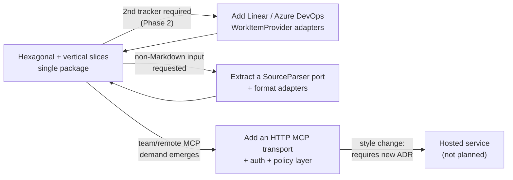

# Architecture Styles

| Attribute        | Value                       |
| ---------------- | --------------------------- |
| **Project**      | DevWorkWire                 |
| **Version**      | 0.1                         |
| **Status**       | Draft                       |

## Table of Contents

- [Decision Summary](#decision-summary)
- [Architecture Style Evaluation](#architecture-style-evaluation)
- [Bounded Context Alignment](#bounded-context-alignment)
- [Rationale and Trade-offs](#rationale-and-trade-offs)
- [Evolution Strategy](#evolution-strategy)
- [Scalability Alignment](#scalability-alignment)
- [Source References](#source-references)

## Decision Summary

**Selected style:** Hexagonal (Ports & Adapters) with vertical feature slices, shipped as
a single distributable Python package.
**Linked ADR:** [ADR-001 — Hexagonal Architecture with Vertical Feature Slices](../../04-decisions/adr-001-hexagonal-vertical-slices.md) (Proposed).

> **Note on this evaluation.** The usual monolith / modular-monolith / microservices axis
> does not apply to DevWorkWire: it is a locally installed CLI and stdio MCP server with
> no hosted runtime, no network listener, and one user per process. The meaningful choice
> is not *how many deployables* but *how the single deployable is internally structured*
> — specifically, how strongly the tracker integration is isolated. The candidates below
> replace the template's columns accordingly.

The dominant constraint is **a single part-time developer** (see
[Role Mapping](../../02-planning/role-mapping.md) and the single-developer bandwidth risk
in the [Phased Roadmap](../../02-planning/phased-roadmap.md)) building toward a stated
Phase 2 goal of adding Linear and Azure DevOps adapters *without touching the core*. That
combination rules out both extremes: no time for ceremony that buys nothing today, but
no tolerance for a Jira-coupled core that would make Phase 2 a rewrite. Hexagonal with a
single `WorkItemProvider` port is the minimum structure that makes the provider swap a
non-event; vertical slicing keeps each feature's code in one place so a solo developer
isn't navigating four layer directories to change one behavior.

## Architecture Style Evaluation

| Criterion | Flat single-module CLI | Layered hexagonal | **Hexagonal + vertical slices** | Local daemon + thin client |
| --------- | ---------------------- | ----------------- | ------------------------------- | -------------------------- |
| Solo-developer fit | Best short-term — no structure to maintain | Good, but a one-line change spans four directories | **Best sustained — feature code is co-located, structure is only as deep as the port boundary** | Poor — a background service to build, ship, debug, and support alone |
| Time to MVP | Fastest to first commit, slowest by F-003 as coupling accumulates | Slightly slower than slices | **Fast — slice boundaries follow the feature docs (F-001…F-007) directly** | Slowest by a wide margin |
| Provider swap cost (Phase 2) | Prohibitive — Jira calls scattered everywhere | Low — one port, one adapter | **Low — identical port isolation** | Low, but irrelevant given the other costs |
| Enforcing one confirm gate | Poor — nothing prevents a second write path | **Best — layering makes a bypass conspicuous** | Adequate — requires the gate to stay in the shared kernel, plus a CI guard | Adequate |
| Testability (`NFR-X03`, ≥80%) | Poor — logic inseparable from I/O and terminal | Good — ports mock cleanly | **Good — identical port isolation; slices test as units** | Poor — needs process orchestration in tests |
| Operational complexity | None | None | **None — still one package, one process** | High — lifecycle, ports, stale-daemon failures, credentials at rest |
| Security surface | Small | Small | **Small — no listener** | Large — a long-lived process holding tracker credentials |
| Evolution path | Dead end; rewrite required | Clean | **Clean — new provider = new adapter; new feature = new slice** | Enables remote MCP, which no requirement asks for |

**Why hexagonal + vertical slices wins:** it is the only candidate that scores well on
*both* axes that matter — provider-swap cost (the Phase 2 goal) and solo-developer
ergonomics (the top project risk) — while adding no operational or security surface. Its
one weakness, a structurally possible second write path, is a known, cheaply mitigated
problem; the flat option's weaknesses are not fixable without a rewrite, and the daemon
option pays real security and support cost for capability nothing requires.

## Bounded Context Alignment

Contexts map one-to-one onto the feature slices, with a shared kernel holding what must
not be duplicated. All dependencies point inward toward the kernel; no slice depends on
another slice.

| Bounded Context | Module/Package | Responsibility | Depends On |
| --------------- | -------------- | -------------- | ---------- |
| Work Item Model (shared kernel) | `core/domain` | Provider-neutral Epic / Story / Acceptance Criteria model, value objects, invariants | — (depends on nothing) |
| Trust & Orchestration (shared kernel) | `core` — `WorkItemService`, confirm gate | Classifies every operation by Trust Tier and enforces confirm-before-execute; the single entry point for both front doors | `core/domain`, `core/ports` |
| Provider Contract | `core/ports` | `WorkItemProvider` and `StateStore` protocols | `core/domain` |
| Document Loading | `features/import_` | Markdown parsing, structural validation, preview construction, dedup matching, drift detection, fail-fast commit ([F-001](../../01-requirements/f-001-validate-preview-commit.md), [F-002](../../01-requirements/f-002-dedup-on-rerun.md)) | `core/domain`, `core/ports` |
| Work Item Access | `features/workitem` | Single-item create/read/update; status- and assignee-filtered queries ([F-005](../../01-requirements/f-005-work-item-crud.md), [F-006](../../01-requirements/f-006-mcp-work-context-query.md)) | `core/domain`, `core/ports` |
| Progress Reporting | `features/progress` | Comments, status transitions, PR-reference writes ([F-007](../../01-requirements/f-007-progress-reporting.md)) | `core/domain`, `core/ports` |
| Tracker Integration | `infrastructure/external/jira` | The only Jira-aware code: REST v3 calls, field mapping, retry, error translation | `core/ports`, `core/domain` |
| Local Persistence & Config | `infrastructure/local` | Config load/validate ([F-008](../../01-requirements/f-008-provider-auth-configuration.md)); import references, drift baselines, idempotency keys | `core/ports` |
| Front Doors | `presentation/cli`, `presentation/mcp` | Rendering, prompting, tool schemas — no business rules ([F-003](../../01-requirements/f-003-cli-dwire-flow.md), [F-004](../../01-requirements/f-004-mcp-tool-surface.md)) | `core` only |
| Composition Root | `composition` | Constructs and injects concrete adapters; the only module that names both a port and its implementation | Everything |

**Invariant to enforce:** `presentation/` must never import `infrastructure/`, and no
feature slice may import another feature slice. Both are mechanically checkable and
belong in CI (see [CI/CD Pipeline](../ops/ci-cd-pipeline.md)).

## Rationale and Trade-offs

- **Pros**
  - Phase 2 provider adapters are additive: implement `WorkItemProvider`, register it in
    the composition root, change nothing else — exactly the stated technical goal.
  - The confirm gate exists once, so the CLI and MCP cannot drift apart
    ([FR-004-01](../../01-requirements/f-004-mcp-tool-surface.md)) — the product's central
    claim is structurally protected rather than maintained by discipline.
  - Core logic is testable with in-memory fakes for both ports, making the ≥80% coverage
    target in [NFR-X03](../../01-requirements/README.md#cross-cutting-quality-baseline)
    reachable without network mocking.
  - Feature slices line up with the feature docs, so a requirement change has an obvious
    home.
  - Zero operational footprint: one package, one process, no listener.

- **Cons / accepted risks**
  - *A slice could bypass the confirm gate.* Slicing puts write-capable use cases next to
    the provider port. **Mitigation:** the gate lives in the shared kernel; slice use cases
    are reachable only through `WorkItemService`; a CI import/architecture guard asserts no
    slice performs an ungated provider write.
  - *Shared-kernel gravity.* Anything genuinely shared drifts into `core/`, which can
    swell into a junk drawer. **Mitigation:** the kernel is limited to the domain model,
    the two ports, and the service/gate; anything else needs a justification recorded in an
    ADR.
  - *More indirection than a ~5k-line tool strictly needs.* **Mitigation:** accepted
    deliberately — it is the price of the Phase 2 goal, and it is paid once, in Phase 0's
    architecture skeleton.
  - *Cross-slice features are awkward.* A future capability spanning import and progress
    has no natural home. **Mitigation:** promote genuinely shared behavior to the kernel
    rather than letting slices import each other.

## Evolution Strategy

DevWorkWire evolves by **adding adapters and slices**, not by splitting the deployable.
The realistic pressures are a second tracker, a second input format, and remote MCP
hosting — the first two are absorbed by the existing structure; only the third would
change the style, and nothing currently asks for it.

### Trigger-based extraction criteria

- **A second `WorkItemProvider` is needed** (planned, Phase 2) — no structural change;
  add an adapter and a config field selecting it. If this turns out to require changing
  the port, the port was wrong, and the ADR should record why.
- **A non-Markdown source format is requested** — parsing is currently internal to
  `features/import_`. Extract a `SourceParser` port only when a second format actually
  arrives, not in anticipation of one.
- **Remote/multi-user MCP demand emerges** — this is the only genuine style change: it
  introduces a network listener, inbound authentication, and the policy layer deliberately
  deferred in [Out of Scope](../../00-context/out-of-scope.md#governance-phase-4-only-if-demand-emerges).
  It requires a new ADR and a fresh threat model; do not drift into it incrementally.
- **The state store outgrows local files** — only relevant if state must be shared across
  machines or users, which is the same trigger as above.

### Migration path

The order below matters: the port must be proven by a real second implementation before
anything is built on the assumption that it generalizes.

1. **Phase 0 — harden the boundaries.** Stand up the skeleton with `WorkItemProvider` and
   `StateStore` defined and the composition root wiring them, before any feature logic
   exists. Add the CI architecture guard at the same time, while there is nothing to fix.
2. **MVP — prove the port with one adapter.** Build the Jira adapter and keep every Jira
   concept behind it. Any Jira vocabulary that leaks into `core/` or `features/` is a
   defect, not a shortcut.
3. **Phase 2 — validate with a second adapter.** Implement Linear against the unchanged
   port. This is the real test of the design; the ADR should be updated with what the
   second implementation revealed.
4. **Only if triggered — extract further ports or transports.** Each such step gets its own
   ADR recording the trigger that fired.

## Scalability Alignment

The scalability NFR ([NFR-X05](../../01-requirements/README.md#cross-cutting-quality-baseline))
is **Draft** with a `TBD` target, deliberately: the scope is bounded to one Jira project
per configuration ([FR-008-04](../../01-requirements/f-008-provider-auth-configuration.md)),
and the tool is single-user and interactive by construction. There is no concurrent load
to scale against.

What the chosen style does provide is that **growth is absorbed at the edges**. Document
size, item count, and Jira round-trips are all handled inside the import slice and the
Jira adapter; the domain model and the confirm gate are indifferent to volume.

At roughly 10x today's assumed working set — say, a several-hundred-item document — the
constraint would be Jira's API round-trips and rate limits, not DevWorkWire's structure.
The changes that would follow (streaming the parse instead of holding the tree in memory;
bounded-concurrency commits with per-item rather than fail-fast error handling) are both
contained within `features/import_` and the Jira adapter. **No style change is implied.**
Revisit once `NFR-X04` and `NFR-X05` have measured targets.

## Source References

- [Architecture Solution Design](./architecture-solution-design.md)
- [Technology Stack](./technology-stack.md)
- [ADR Decision Log](../../04-decisions/README.md)
- [Project Overview](../../00-context/overview.md)
- [Phased Roadmap](../../02-planning/phased-roadmap.md)

---

**Last Updated**: 2026-08-31
