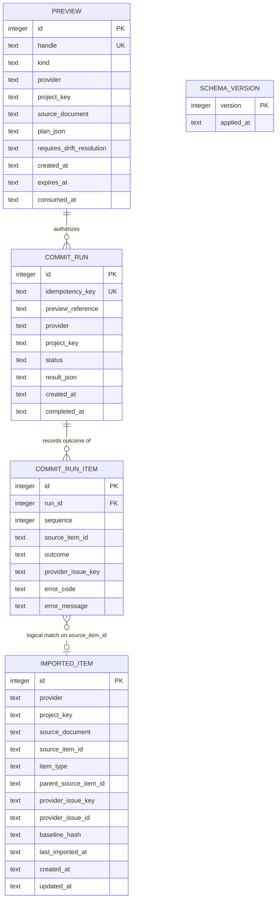

# Database Design

| Attribute        | Value                       |
| ---------------- | --------------------------- |
| **Project**      | DevWorkWire                 |
| **Version**      | 0.1                         |
| **Status**       | Draft                       |

## Table of Contents

- [Design Scope and Assumptions](#design-scope-and-assumptions)
- [Data Domains](#data-domains)
- [Core Entities](#core-entities)
- [Relationships](#relationships)
- [Entity-Relationship Diagram (ERD)](#entity-relationship-diagram-erd)
- [Schema Documentation](#schema-documentation)
- [Constraints and Integrity Rules](#constraints-and-integrity-rules)
- [Access Patterns and Indexing Notes](#access-patterns-and-indexing-notes)
- [Migration and Evolution Considerations](#migration-and-evolution-considerations)
- [Security and Data Governance](#security-and-data-governance)
- [Risks and Open Questions](#risks-and-open-questions)
- [Traceability to Requirements](#traceability-to-requirements)
- [Source References](#source-references)

## Design Scope and Assumptions

DevWorkWire has **no server database**. The system of record for work items is the Jira
instance; nothing about an Epic, Story, or Acceptance Criterion is owned locally. What
this document specifies is a small **local SQLite state store** that exists only to make
re-runs safe.

- **SQLite via the stdlib `sqlite3` module.** Chosen for atomic transactions: a crash
  partway through a commit must not leave a half-written index, because the record of
  what was already written is exactly what makes the
  [FR-001-06](../../01-requirements/f-001-validate-preview-commit.md) fail-fast retry safe.
  No dependency, no server, no daemon.
- **One store per project, colocated with the config.** `.devworkwire/state.db` beside
  `.devworkwire.yaml`, matching the one-config-one-project scope of
  [FR-008-04](../../01-requirements/f-008-provider-auth-configuration.md). **It must be
  gitignored** — it is machine state, not repository content.
- **Single writer, single process.** One user, one command at a time. No concurrency
  model, no pooling, no locking strategy beyond SQLite's own.
- **The store is a rebuildable cache, not a source of truth.** The authoritative link
  between a source-document item and a Jira issue is the reference field stored *on the
  Jira issue* ([FR-002-01](../../01-requirements/f-002-dedup-on-rerun.md)); matching is
  primarily via that field ([FR-002-02](../../01-requirements/f-002-dedup-on-rerun.md)).
  The local store caches those links and adds the drift baselines and idempotency records
  that have nowhere else to live.

That last assumption is the load-bearing one. **Deleting `state.db` must never cause
duplicate issues** — a rebuild re-queries Jira for issues carrying the reference field and
restores the index. The only thing genuinely lost is drift history: every matched item
reads as clean until the next import re-establishes its baseline. This is the failure mode
to design toward, since users will delete this file, switch machines, and clone repos
fresh.

- **No PII is stored.** Assignees, reporters, comment authors, summaries, and Acceptance
  Criteria text are never written to the local store — see
  [Security and Data Governance](#security-and-data-governance) and
  [NFR-X02](../../01-requirements/README.md#cross-cutting-quality-baseline).

## Data Domains

| Domain | Entities | Responsibility |
| ------ | -------- | -------------- |
| Import Index | `imported_item` | Maps a source-document item to the Jira issue created from it, and records the drift baseline for that issue |
| Preview Gate | `preview` | Holds each issued preview handle and the exact plan it authorizes, so a commit executes the reviewed plan rather than a recomputed one |
| Commit Idempotency | `commit_run`, `commit_run_item` | Records the outcome of each commit batch so a retried commit replays its result instead of re-writing, and so a fail-fast stop is resumable |
| Store Metadata | `schema_version` | Tracks the on-disk schema version for in-process migration |

## Core Entities

| Entity | Purpose | Key Attributes | Owning Domain |
| ------ | ------- | -------------- | ------------- |
| `imported_item` | One row per source-document item successfully written to Jira | source document + source item id, provider issue key, baseline hash, last imported at | Import Index |
| `preview` | One row per issued preview handle, holding the plan it authorizes and its expiry | handle, plan json, expires at, consumed at | Preview Gate |
| `commit_run` | One row per `import.commit` / CLI commit batch, keyed by idempotency key | idempotency key, preview reference, status, stored result | Commit Idempotency |
| `commit_run_item` | Per-item outcome inside a run: committed, failed, or untried | run id, source item id, sequence, outcome, error | Commit Idempotency |
| `schema_version` | Single-row table holding the applied schema version | version | Store Metadata |

## Relationships

- `preview` **1 — 0..N** `commit_run`: a handle authorizes the commits that reference it.
  Normally exactly one, but an idempotency replay produces a second lookup against the same
  handle. Enforced as a foreign key with `ON DELETE RESTRICT`: pruning an expired preview
  must not orphan the commit record that proves a write happened.
- `commit_run` **1 — N** `commit_run_item`: a run owns its per-item outcomes. Deleting a
  run (retention pruning) cascades to its items.
- `commit_run_item` **N — 1** `imported_item` (logical, not enforced): a successfully
  committed item corresponds to an `imported_item` row for the same
  `(source_document, source_item_id)`. Deliberately **not** a foreign key — a failed or
  untried item has no `imported_item` row, and pruning old runs must not be blocked by
  index rows that are still current.
- `imported_item` rows are independent of each other. Parent/child structure lives in the
  source document and in Jira, not here; `parent_source_item_id` is stored only so a
  rebuild can restore Epic-before-Story commit ordering without re-parsing the document.

## Entity-Relationship Diagram (ERD)

## Schema Documentation

> SQLite types are declared with affinity in mind: timestamps are ISO-8601 UTC `TEXT`
> (sortable, human-readable in a file users will inevitably open), and booleans are not
> used.

### 1. `imported_item`

| Column | Type | Constraints | Notes |
| ------ | ---- | ----------- | ----- |
| `id` | INTEGER | PK, AUTOINCREMENT | Surrogate key; the natural key is the unique constraint below |
| `provider` | TEXT | NOT NULL, CHECK in (`jira`) | Widens in Phase 2 for Linear / Azure DevOps |
| `project_key` | TEXT | NOT NULL | From the config; guards against a repointed config matching the wrong project's issues |
| `source_document` | TEXT | NOT NULL | Repo-relative path of the source Markdown, normalized. Relative so the store survives the repo being moved or cloned elsewhere |
| `source_item_id` | TEXT | NOT NULL | The stable ID within the document; the same value written to the Jira reference field |
| `item_type` | TEXT | NOT NULL, CHECK in (`epic`,`story`) | Drives commit ordering on rebuild |
| `parent_source_item_id` | TEXT | NULL for epics | Stored only to restore Epic-before-Story ordering without re-parsing |
| `provider_issue_key` | TEXT | NOT NULL | e.g. `PROJ-123`. Human-facing, but mutable — Jira changes it if an issue moves project |
| `provider_issue_id` | TEXT | NOT NULL | Jira's immutable numeric id. The reliable identifier; `provider_issue_key` is for display |
| `baseline_hash` | TEXT | NOT NULL | Hash of the DevWorkWire-managed fields as they stood at last import. See [Constraints](#constraints-and-integrity-rules) |
| `last_imported_at` | TEXT | NOT NULL | ISO-8601 UTC |
| `created_at` | TEXT | NOT NULL, default now | |
| `updated_at` | TEXT | NOT NULL, default now | Refreshed on every successful re-import of the item |

**Unique:** `(provider, project_key, source_document, source_item_id)` — one index row per
document item. Also **unique:** `(provider, project_key, provider_issue_id)` — two
document items must never claim the same Jira issue, which is the corruption that would
silently overwrite a user's work.

**Notes:** Rows are written per item immediately after that item's successful Jira write,
not batched at the end of a run. This is what makes a fail-fast stop resumable. No row is
ever written for a create that failed.

### 2. `preview`

Holds each issued preview handle **together with the plan it authorizes**. This is what
makes "the commit executes the reviewed plan, not a recomputed one"
([FR-001-05](../../01-requirements/f-001-validate-preview-commit.md)) a structural
property. It is persisted rather than held in memory so a preview survives an MCP server
restart or a separate CLI invocation — agent harnesses restart subprocesses routinely, and
losing previews to that would train users to re-preview reflexively, eroding the gate.

| Column | Type | Constraints | Notes |
| ------ | ---- | ----------- | ----- |
| `id` | INTEGER | PK, AUTOINCREMENT | |
| `handle` | TEXT | NOT NULL, UNIQUE | The opaque `preview_handle` returned to the caller. Randomly generated, not derived from content — a guessable handle would be a gate weakness |
| `kind` | TEXT | NOT NULL, CHECK in (`import`,`progress`) | An `import` handle must not be accepted by `progress.commit` or vice versa |
| `provider` | TEXT | NOT NULL | |
| `project_key` | TEXT | NOT NULL | A handle is not valid against a different project than it was built for |
| `source_document` | TEXT | NULL for progress and inline-item previews | |
| `plan_json` | TEXT | NOT NULL | The serialized plan: every `PlanItem` with its action, target issue, and intended changes |
| `requires_drift_resolution` | TEXT | NOT NULL, default `[]` | JSON array of `source_item_id`s that must carry an explicit overwrite/skip at commit ([FR-002-04](../../01-requirements/f-002-dedup-on-rerun.md)) |
| `created_at` | TEXT | NOT NULL, default now | |
| `expires_at` | TEXT | NOT NULL | `created_at` + TTL (proposed 30 minutes) |
| `consumed_at` | TEXT | NULL until committed | Set on successful commit; a consumed handle is re-presentable only through the idempotency replay path, never for re-execution |

**Notes:** `plan_json` is derived from the source document and from Jira reads, so it is
the one place in the store that can hold issue content — see
[Security and Data Governance](#security-and-data-governance). Expired and consumed rows
are pruned on store open.

### 3. `commit_run`

| Column | Type | Constraints | Notes |
| ------ | ---- | ----------- | ----- |
| `id` | INTEGER | PK, AUTOINCREMENT | |
| `idempotency_key` | TEXT | NOT NULL, UNIQUE | Client-supplied ([FR-004-04](../../01-requirements/f-004-mcp-tool-surface.md)). The CLI generates one per confirmed commit so both front doors share the mechanism |
| `preview_id` | INTEGER | NOT NULL, FK → `preview(id)` ON DELETE RESTRICT | The preview being confirmed; a commit whose key matches but whose preview does not is `IDEMPOTENCY_KEY_REUSED`, not a replay |
| `provider` | TEXT | NOT NULL | |
| `project_key` | TEXT | NOT NULL | |
| `status` | TEXT | NOT NULL, CHECK in (`in_progress`,`completed`,`failed`) | Written `in_progress` **before** the first Jira write, so a crashed run is distinguishable from one that never started |
| `result_json` | TEXT | NULL until terminal | The result returned verbatim on replay, satisfying "returns the original result without re-writing" |
| `created_at` | TEXT | NOT NULL, default now | Drives retention pruning |
| `completed_at` | TEXT | NULL until terminal | |

**Notes:** A replayed key in `in_progress` state means a previous run died mid-commit. It
must not silently replay a result that does not exist — the correct response is to report
the interrupted run and let the user re-preview, which will match the already-committed
items via the import index.

### 4. `commit_run_item`

| Column | Type | Constraints | Notes |
| ------ | ---- | ----------- | ----- |
| `id` | INTEGER | PK, AUTOINCREMENT | |
| `run_id` | INTEGER | NOT NULL, FK → `commit_run(id)` ON DELETE CASCADE | |
| `sequence` | INTEGER | NOT NULL | Commit order within the run; makes "committed before / untried after" reconstructable |
| `source_item_id` | TEXT | NOT NULL | |
| `outcome` | TEXT | NOT NULL, CHECK in (`committed`,`failed`,`untried`) | The three-way split [FR-001-06](../../01-requirements/f-001-validate-preview-commit.md) requires |
| `provider_issue_key` | TEXT | NULL unless committed | |
| `error_code` | TEXT | NULL unless failed | Stable internal code, not raw HTTP text |
| `error_message` | TEXT | NULL unless failed | Redacted and length-capped — see [Security and Data Governance](#security-and-data-governance) |

**Unique:** `(run_id, source_item_id)`.

### 5. `schema_version`

| Column | Type | Constraints | Notes |
| ------ | ---- | ----------- | ----- |
| `version` | INTEGER | PK | Single row |
| `applied_at` | TEXT | NOT NULL | |

## Constraints and Integrity Rules

- **`PRAGMA foreign_keys = ON` on every connection.** SQLite disables FK enforcement by
  default, so the `commit_run_item` cascade is inert unless this is set explicitly.
- **One Jira issue per document item, both directions.** The two unique constraints on
  `imported_item` are the integrity rules that prevent the two failure modes that matter:
  duplicate issues for one item, and two items overwriting the same issue.
- **`baseline_hash` covers only DevWorkWire-managed fields** — summary, description,
  acceptance criteria, parent link, issue type. It deliberately excludes status,
  assignee, comments, and labels, so ordinary team activity on an issue does not read as
  drift. A gate that cries wolf is a gate users learn to click through, which would
  undermine [FR-002-04](../../01-requirements/f-002-dedup-on-rerun.md).
- **The hash is computed over a canonical serialization** (fixed field order, normalized
  whitespace and line endings) so that a semantically identical issue hashes identically
  across runs and platforms.
- **Index rows are written only after the corresponding Jira write succeeds.** The store
  must never claim an issue exists that does not.
- **Business invariants stay in the domain layer.** Parent/child validity, count matching,
  and orphan detection are enforced in `features/import_` against the parsed document, not
  by database constraints — the store indexes outcomes, it does not validate structure.

## Access Patterns and Indexing Notes

| Query / Access Pattern | Frequency | Supporting Index |
| ---------------------- | --------- | ---------------- |
| Look up an item's Jira issue + baseline by document and source id (the preview hot path, once per item) | Very high | Unique `(provider, project_key, source_document, source_item_id)` |
| Reverse lookup: which document item produced this Jira issue | Medium | Unique `(provider, project_key, provider_issue_id)` |
| Resolve a `preview_handle` at commit time | Once per commit | Unique `(handle)` |
| Replay check on an idempotency key | Once per commit | Unique `(idempotency_key)` |
| Reconstruct per-item outcomes for a run | Low | `(run_id, sequence)` |
| Prune expired/consumed previews and old runs | Once per store open | `preview(expires_at)`, `commit_run(created_at)` |

At realistic sizes — hundreds of rows, not millions — these indexes are about correctness
and constraint enforcement more than speed. Every one of them backs a uniqueness rule or a
lookup that runs once per item in a preview.

**Practical note:** the preview path should load the whole index for the source document
in a single query rather than issuing one lookup per item. The per-item cost that matters
is the Jira round-trip, not the SQLite read.

## Migration and Evolution Considerations

There is no operator and no migration tool — the "DBA" is a developer running `dwire` who
does not know this file exists. Migration therefore has to be automatic and safe by
construction.

- **Versioned, in-process migration on open.** Read `schema_version`, apply ordered
  migration steps up to the current version, in one transaction. A store newer than the
  running binary (after a downgrade) is refused with a clear message rather than being
  read on optimistic assumptions.
- **Additive-first.** New columns are nullable or defaulted; existing columns are not
  renamed or retyped in place.
- **The rebuild escape hatch.** Because the store is a cache, a migration that would
  otherwise be breaking may instead drop and rebuild the index from Jira by querying for
  issues carrying the reference field. This is the option a server-backed system does not
  have, and it should be used rather than writing an elaborate data migration.
- **Retention pruning**, run on store open:
  - `preview` — delete rows past `expires_at`, and consumed rows once their commit run is
    itself pruned. Previews hold plan content, so keeping them longer than the gate needs
    is the store's main privacy exposure ([Security and Data
    Governance](#security-and-data-governance)). **Proposed TTL: 30 minutes.**
  - `commit_run` (cascading to its items) — **proposed: 30 days.** These rows answer "have
    I already done this?" for a retry, which is a short-lived question. Long enough to
    cover any realistic retry or interrupted-run investigation, short enough that the file
    does not grow without bound. Note the `ON DELETE RESTRICT` ordering: a preview cannot
    be pruned while a commit run still references it, so runs are pruned first.
  - `imported_item` — **never pruned.** It is the dedup index; losing a row means creating
    a duplicate.

  *Both windows are proposals for ADR-005, not yet decided values.*
- **File permissions `0600` on creation**, matching the config directory.

## Security and Data Governance

- **No credentials, ever.** The Jira API token is never written here or anywhere on disk
  ([NFR-008-01](../../01-requirements/f-008-provider-auth-configuration.md)). The store
  holds no authentication material of any kind.
- **No durable content storage.** This is why the drift baseline is a hash rather than a
  snapshot: assignees, reporters, summaries, descriptions, and Acceptance Criteria text
  never enter the permanent `imported_item` index. Jira issue keys and ids are identifiers,
  not personal data.
- **`preview.plan_json` is the one real qualification to that**, and it should be stated
  plainly rather than glossed. A plan necessarily contains the titles, descriptions, and
  Acceptance Criteria text it is about to write, plus the tracker-side values it is
  comparing against. So issue content *does* touch disk — **transiently**, bounded by the
  30-minute TTL and pruned on the next store open.
  [NFR-X02](../../01-requirements/README.md#cross-cutting-quality-baseline) states that
  local storage holds no PII beyond connection settings; that NFR was written before this
  table existed and should be revisited to either explicitly permit transient plan storage
  or require a stricter approach. Mitigations that apply regardless: never store assignee,
  reporter, or comment-author identities in a plan (they are not fields DevWorkWire
  writes), and prune aggressively.
- **`result_json` and `error_message` are the other two content-derived fields.** Rules:
  store the structured commit result (item ids, issue keys, outcomes) rather than raw
  response bodies; translate errors to internal codes with a redacted, length-capped
  message; never persist a raw response body or any request header.
- **Access control is filesystem permissions.** `0600`, in a gitignored `.devworkwire/`
  directory. There is no row-level security model because there is exactly one user.
- **Deletion is user-controlled and safe.** Deleting `.devworkwire/state.db` loses drift
  history only; the reference fields on the Jira issues remain, so a subsequent import
  still matches and does not duplicate. Documentation should state this plainly so users
  are not afraid of the file.
- **Gitignore is a governance requirement, not a nicety.** A committed `state.db` puts
  one developer's local machine state into shared history. Project setup docs and any
  `dwire init` scaffolding must add `.devworkwire/` to `.gitignore`.

## Risks and Open Questions

| Risk / question | Impact | Mitigation / owner |
| --------------- | ------ | ------------------ |
| The Jira reference custom field requires admin rights to create, which a user on someone else's instance may not have | Blocks [F-002](../../01-requirements/f-002-dedup-on-rerun.md) entirely for that user | Config validation must detect the missing field and fail with setup instructions before any write ([FR-008-03](../../01-requirements/f-008-provider-auth-configuration.md)). Tech Lead |
| A user deletes the reference field value on an issue, or deletes the issue | That item is re-created as a duplicate on next run | Documented as a known limitation in [F-002](../../01-requirements/f-002-dedup-on-rerun.md); a re-link recovery path is explicitly deferred. Product Owner |
| The hash baseline cannot show *what* changed, only *that* something did | The [FR-002-04](../../01-requirements/f-002-dedup-on-rerun.md) overwrite-or-skip choice is less informed than it could be | Accepted trade-off for the NFR-X02 privacy property. The preview can fetch and diff the live issue on demand for a drifted item, without persisting it — worth prototyping. Tech Lead |
| `source_document` is a path, so renaming or moving the source file orphans its index rows | Items re-created as duplicates after a file rename | Match falls back to the Jira reference field, which is path-independent — this is why matching is "primarily via the stored reference" and not via the local index. Verify this fallback is actually exercised by a test |
| Retention windows (30 min preview, 30 days run) are unvalidated | Either bloat, a lost replay, or content held longer than needed | Open for ADR-005; revisit after real usage |
| `preview.plan_json` stores issue content on disk, which [NFR-X02](../../01-requirements/README.md#cross-cutting-quality-baseline) does not currently anticipate | The privacy NFR is stated more strongly than the design delivers | Raise with the Product Owner: either amend NFR-X02 to permit transient plan storage under a bounded TTL, or accept losing cross-process previews. **This is a requirements decision, not an implementation detail.** Tech Lead / Product Owner |

## Traceability to Requirements

| Requirement | Schema Element(s) | Notes |
| ----------- | ----------------- | ----- |
| [FR-002-01](../../01-requirements/f-002-dedup-on-rerun.md) | Jira custom field (external) + `imported_item.source_item_id` | The authoritative reference lives on the issue; this table indexes it |
| [FR-002-02](../../01-requirements/f-002-dedup-on-rerun.md) | `imported_item` unique `(provider, project_key, source_document, source_item_id)` | Match on re-run; zero creates for an unchanged document |
| [FR-002-03](../../01-requirements/f-002-dedup-on-rerun.md) | `imported_item.baseline_hash`, `last_imported_at` | Drift = live managed-field hash ≠ stored baseline |
| [FR-002-04](../../01-requirements/f-002-dedup-on-rerun.md) | Read path only — no schema element | The overwrite/skip choice is a runtime decision; only its outcome is recorded |
| [FR-001-05](../../01-requirements/f-001-validate-preview-commit.md) | `preview.plan_json` | The commit executes the stored plan, so "no divergence from the preview" is structural |
| [FR-001-06](../../01-requirements/f-001-validate-preview-commit.md) | `commit_run_item.outcome`, `sequence` | The committed / failed / untried three-way split |
| [FR-004-02/03](../../01-requirements/f-004-mcp-tool-surface.md) | `preview.handle` (unique), `kind`, `expires_at`, `consumed_at` | No commit without a live, matching, unconsumed handle |
| [FR-004-04](../../01-requirements/f-004-mcp-tool-surface.md) | `commit_run.idempotency_key` (unique), `result_json` | Replay returns the stored result with no new writes |
| [FR-005-02/03](../../01-requirements/f-005-work-item-crud.md) | Same `commit_run` / `imported_item` tables | Single-item commits reuse the batch tables, so no divergent path exists ([NFR-005-01](../../01-requirements/f-005-work-item-crud.md)) |
| [NFR-002-01](../../01-requirements/f-002-dedup-on-rerun.md) | Jira custom field (external) | A dedicated field, not a label, so unrelated edits do not clobber it |
| [NFR-008-01](../../01-requirements/f-008-provider-auth-configuration.md) | No credential column exists anywhere | Enforced by schema, not by policy |
| [NFR-X02](../../01-requirements/README.md#cross-cutting-quality-baseline) | `baseline_hash` instead of a content snapshot | No PII reaches disk by construction |

## Source References

- [Database Domain Overview](./README.md)
- [Architecture Solution Design](../core/architecture-solution-design.md)
- [Technology Stack](../core/technology-stack.md)
- [F-002 Dedup on Re-Run](../../01-requirements/f-002-dedup-on-rerun.md)
- [F-008 Provider Authentication & Configuration](../../01-requirements/f-008-provider-auth-configuration.md)
- [ADR Decision Log](../../04-decisions/README.md)

---

**Last Updated**: 2026-08-31
