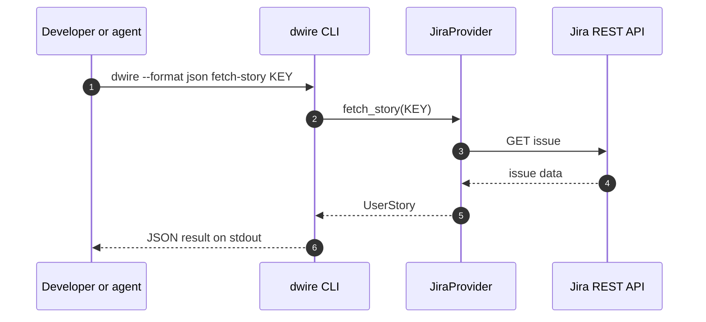
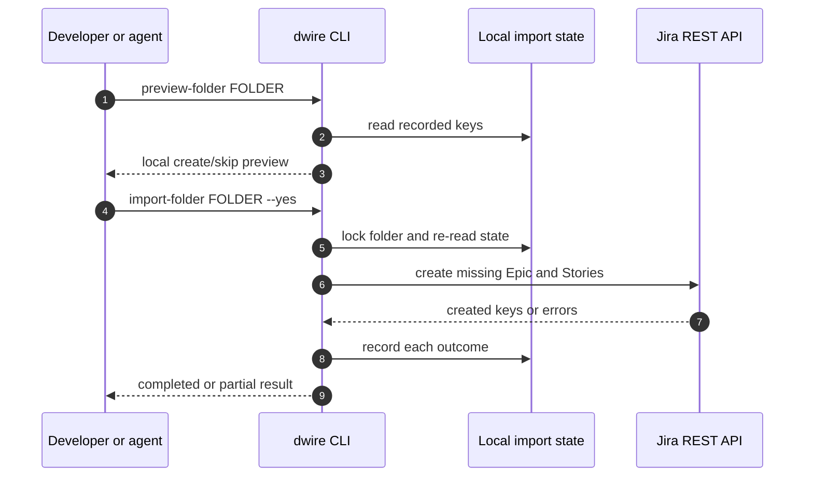

# Sequence diagrams

These diagrams show shipped CLI behavior. The earlier MCP, SQLite preview
handle, Jira-side drift, and fail-fast diagrams described unimplemented
proposals and are superseded by
[ADR-011](../../04-decisions/adr-011-cli-first-agent-integration.md).

## Read a work item

## Preview and import a folder

`preview-folder` makes no Jira write. A non-interactive import needs `--yes`;
the agent may use it only within the user's approved task. When Jira's outcome
is uncertain, the importer stops and records a pending attempt for manual
resolution. A definite story rejection can leave a partial result while later
stories are attempted.

## Diagram coverage by feature

| Feature | Current diagram |
|---|---|
| Individual read | [Read a work item](#read-a-work-item) |
| Folder preview/import | [Preview and import a folder](#preview-and-import-a-folder) |
| Rich query and progress reporting | Planned; no current sequence |
| MCP | Deferred; no current sequence |
