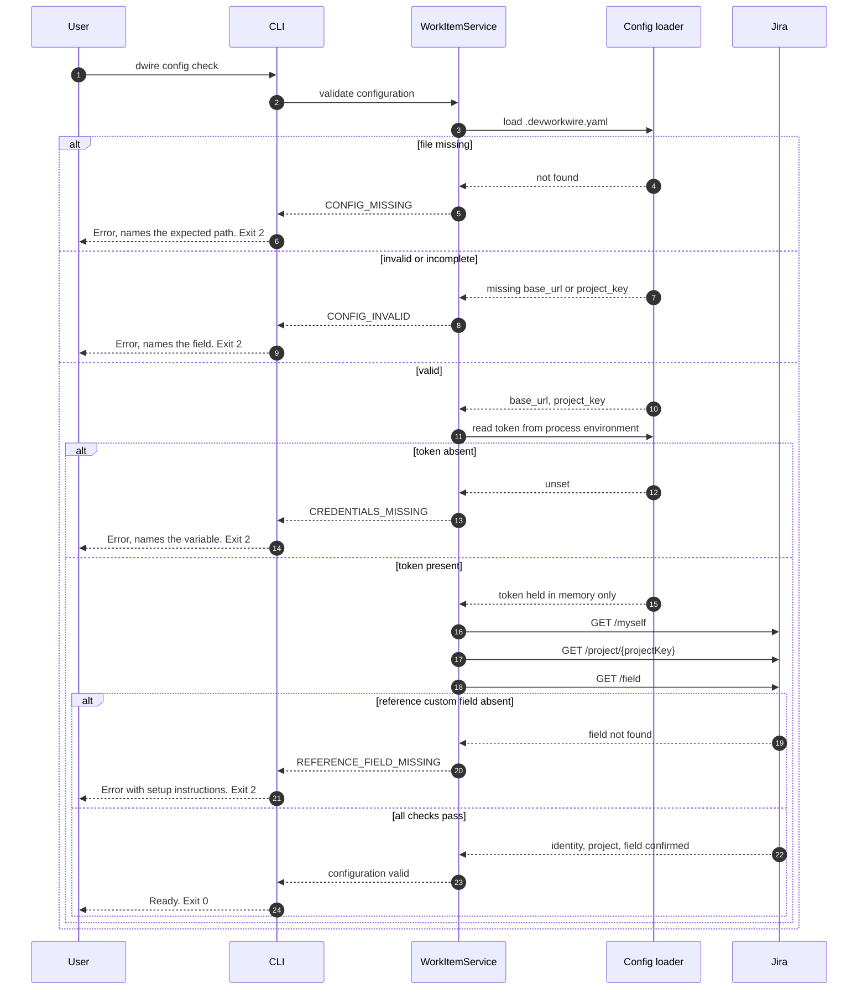
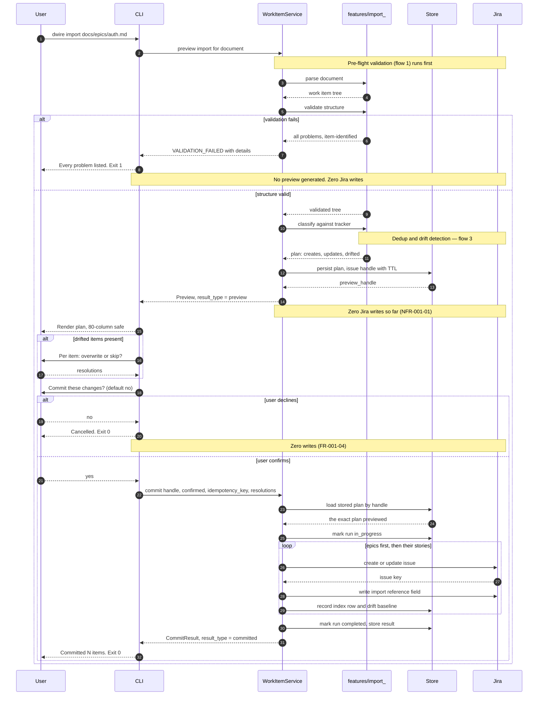
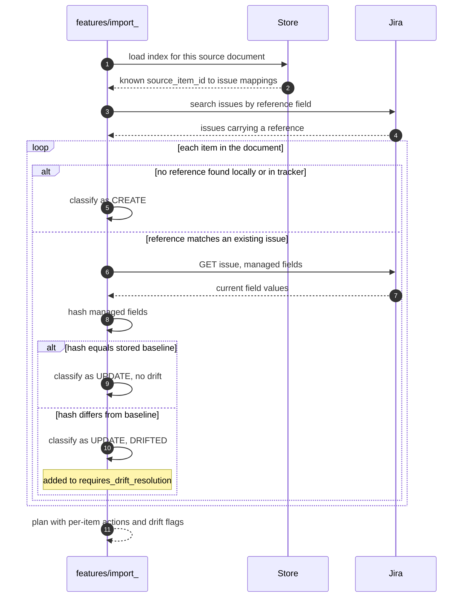
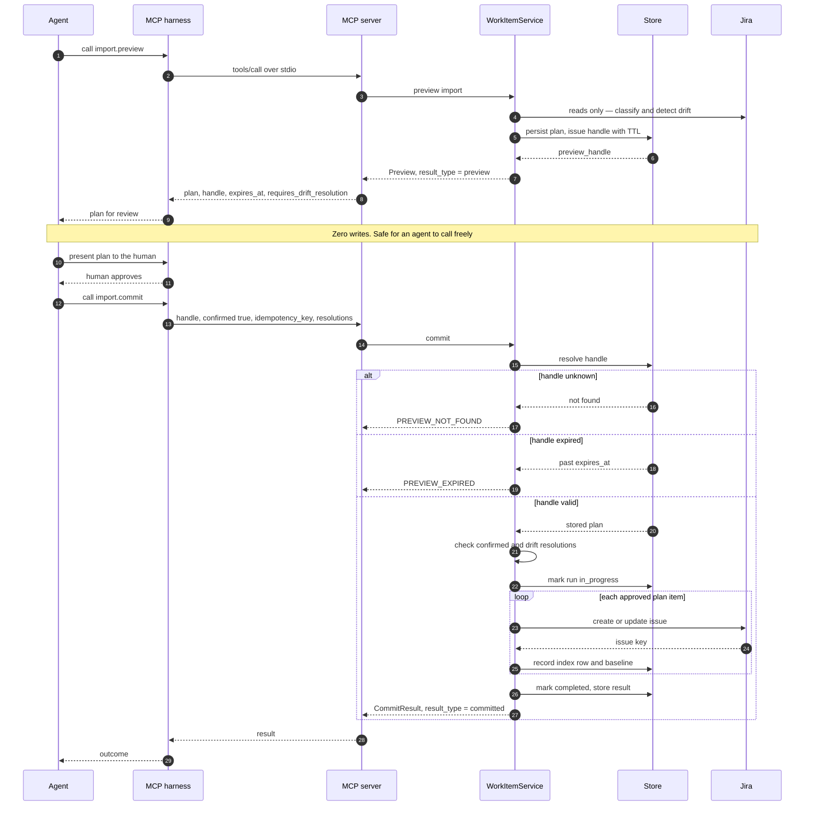
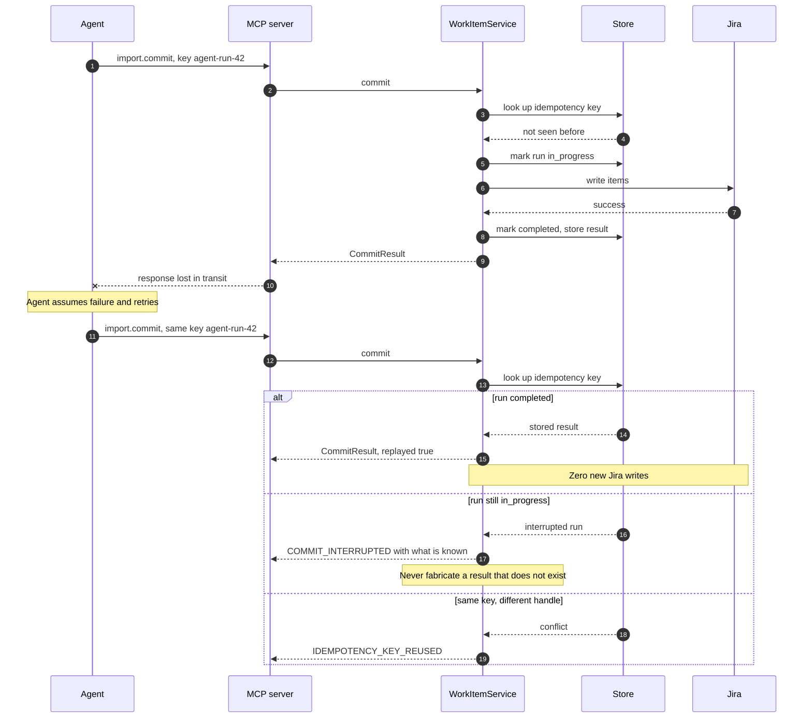
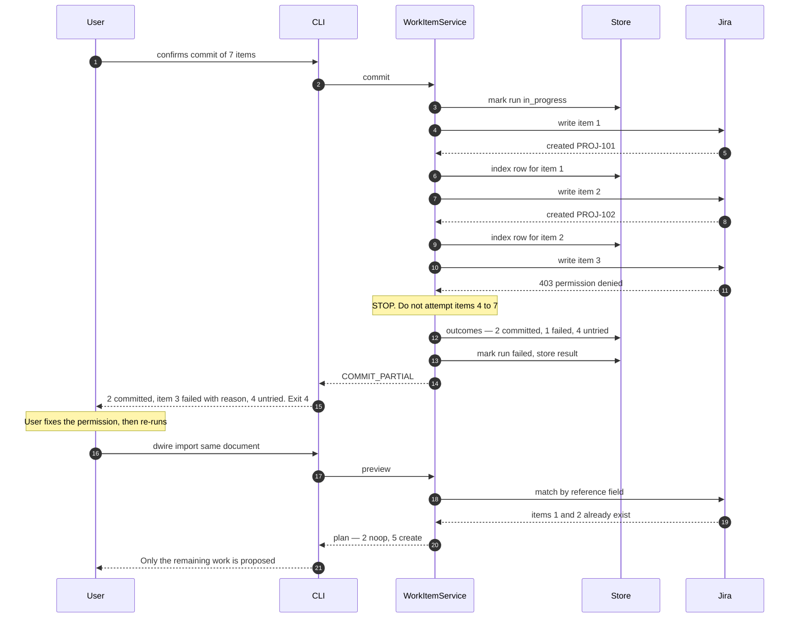
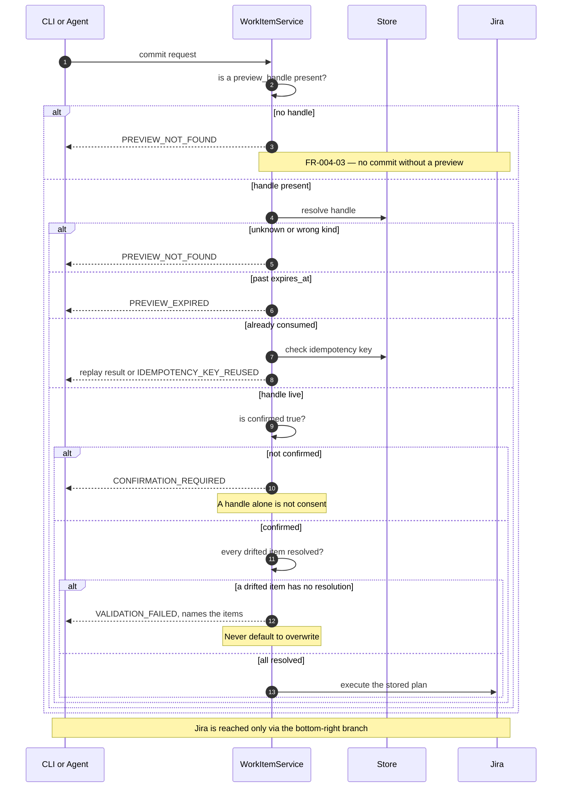
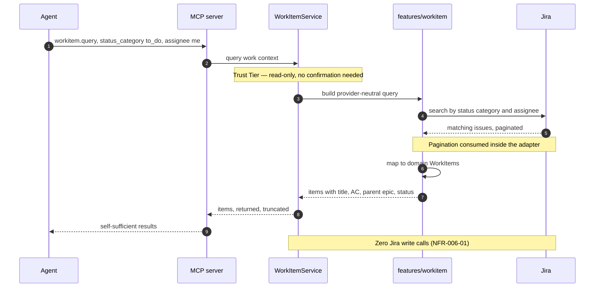
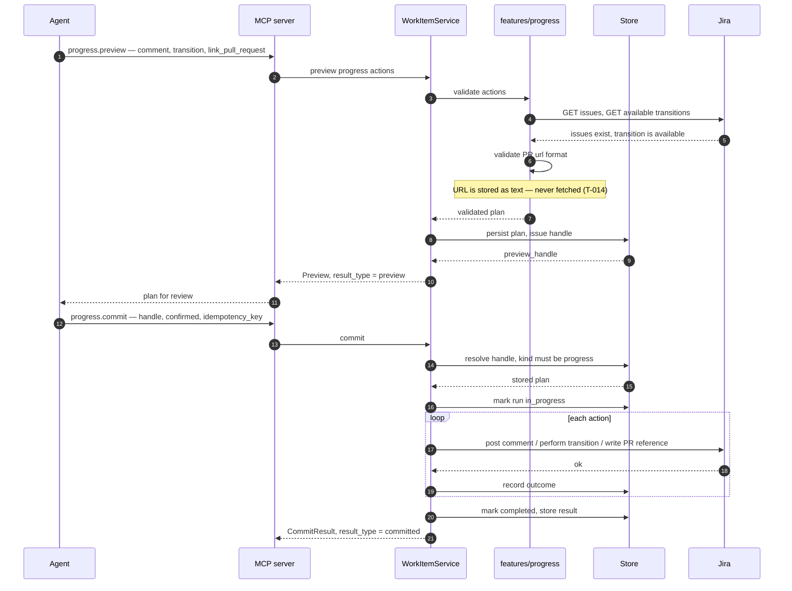
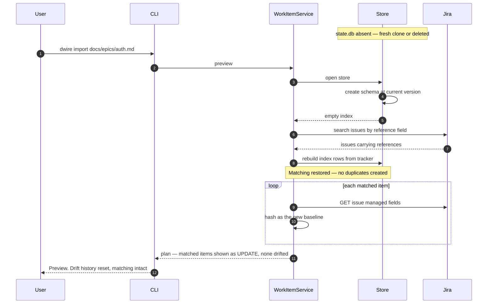

# Sequence Diagrams

| Attribute        | Value                       |
| ---------------- | --------------------------- |
| **Project**      | DevWorkWire                 |
| **Version**      | 0.1                         |
| **Status**       | Draft                       |

## Table of Contents

- [How to Use](#how-to-use)
- [Participants](#participants)
- [1) Configuration and Credential Pre-Flight](#1-configuration-and-credential-pre-flight)
- [2) CLI Import — Validate, Preview, Confirm, Commit](#2-cli-import--validate-preview-confirm-commit)
- [3) Dedup Matching and Drift Detection](#3-dedup-matching-and-drift-detection)
- [4) MCP Import — Preview and Commit Across Two Calls](#4-mcp-import--preview-and-commit-across-two-calls)
- [5) Idempotent Retry — Replay Without Re-Writing](#5-idempotent-retry--replay-without-re-writing)
- [6) Fail-Fast Partial Commit and Resumable Retry](#6-fail-fast-partial-commit-and-resumable-retry)
- [7) Rejected Commit Paths — The Gate Saying No](#7-rejected-commit-paths--the-gate-saying-no)
- [8) Work-Context Query](#8-work-context-query)
- [9) Progress Reporting](#9-progress-reporting)
- [10) State Store Loss and Rebuild](#10-state-store-loss-and-rebuild)
- [Diagram Coverage by Feature](#diagram-coverage-by-feature)
- [Source References](#source-references)

## How to Use

One numbered section per key interaction flow, each with a Mermaid `sequenceDiagram` and a
"Key details" note covering edge cases, error paths, and security checks. Add a row to the
[coverage table](#diagram-coverage-by-feature) for every flow.

> **Reading this early is intended.** This page sits second in the architecture section, on
> purpose — the ten flows are the fastest way to understand how DevWorkWire actually
> behaves before meeting the contract and schema detail. As a result the "Key details" notes
> reference things defined later: error codes and tool arguments come from
> [Interface Design Standards](../interfaces/interface-standards.md) and
> [Interface Contract](../interfaces/interface-contract.md), table and column names from
> [Database Design](../database/database-design.md), and `T-` threat IDs from the
> [Threat Model](../security/threat-model.md). **Treat those as signposts, not gaps** — every
> one is a link, and nothing here requires you to have read them first.

These diagrams are the executable-looking form of those contracts. Where a diagram disagrees
with them, **those documents win and the diagram is a bug.**

## Participants

The same cast appears throughout. Note that **`WorkItemService` is shared by both front
doors** — this is what [FR-004-01](../../01-requirements/f-004-mcp-tool-surface.md) means
by "no divergent logic path", and it is why flows 2 and 4 differ only at the edges.

| Participant | Maps to |
| ----------- | ------- |
| `User` / `Agent` | Maya at a terminal, or Idris's AI agent via a harness |
| `CLI` | `presentation/cli` — Typer + InquirerPy |
| `MCP` | `presentation/mcp` — MCP server over stdio |
| `SVC` | `core` — `WorkItemService` and the confirm gate |
| `IMP` | `features/import_` — parse, validate, classify, commit |
| `Store` | `infrastructure/local` — SQLite state store |
| `Jira` | `infrastructure/external/jira` → Jira Cloud REST v3 |

## 1) Configuration and Credential Pre-Flight

Runs before **any** Jira-touching operation, from either front door
([FR-008-03](../../01-requirements/f-008-provider-auth-configuration.md)). It exists so a
misconfiguration fails immediately with a message naming the problem, instead of surfacing
as a confusing 401 several steps later.

**Key details:**

- The token is read from the **process environment only** — no `.env` discovery, so a token
  from an unintended parent directory can never be picked up silently.
- The token is never written to the config file, the state store, or any log
  ([NFR-008-01](../../01-requirements/f-008-provider-auth-configuration.md)).
- The `REFERENCE_FIELD_MISSING` branch matters more than it looks: creating that custom
  field needs Jira admin rights, and without it **dedup cannot work at all**
  ([F-002](../../01-requirements/f-002-dedup-on-rerun.md)). Failing here with setup
  instructions is far better than silently creating duplicates later.
- An `http://` base URL is rejected at this stage — there is no
  certificate-verification bypass anywhere in the system.

## 2) CLI Import — Validate, Preview, Confirm, Commit

The primary flow ([F-001](../../01-requirements/f-001-validate-preview-commit.md),
[F-003](../../01-requirements/f-003-cli-dwire-flow.md)). One invocation, four phases, one
gate.

**Key details:**

- **The commit executes the stored plan, not a recomputed one.** This is what makes "no
  divergence from the preview"
  ([FR-001-05](../../01-requirements/f-001-validate-preview-commit.md)) structural rather
  than aspirational.
- Validation reports **every** problem in one pass, not the first — which is why the domain
  layer collects errors rather than raising on the first bad field.
- The confirm prompt **defaults to no**. A stray Enter never commits.
- **No TTY means no consent:** running non-interactively exits `CONFIRMATION_REQUIRED`.
  There is deliberately no `--yes` flag ([FR-004-03](../../01-requirements/f-004-mcp-tool-surface.md)).
- Index rows are written **per item**, immediately after each successful write — the
  property that makes flow 6 resumable.
- Epics are written before their Stories so parent links always resolve.

## 3) Dedup Matching and Drift Detection

How an item becomes `create`, `update`, or `update (drifted)`
([F-002](../../01-requirements/f-002-dedup-on-rerun.md)). Called during preview
construction; performs reads only.

**Key details:**

- **The tracker is the authority, not the local index.** Matching is primarily via the
  reference field stored on the Jira issue
  ([FR-002-02](../../01-requirements/f-002-dedup-on-rerun.md)); the local index is a cache
  and a place to keep drift baselines. This is why a renamed source file, or a deleted
  `state.db`, does not cause duplicates.
- The baseline is a **hash of DevWorkWire-managed fields only** — summary, description,
  acceptance criteria, parent link, issue type. Status, assignee, comments, and labels are
  deliberately excluded so ordinary team activity does not read as drift. A gate that cries
  wolf is a gate people learn to click through.
- Hashing is over a canonical serialization (fixed field order, normalized whitespace and
  line endings) so semantically identical content hashes identically across runs and
  platforms.
- Every drifted item **must** carry an explicit overwrite-or-skip at commit time
  ([FR-002-04](../../01-requirements/f-002-dedup-on-rerun.md)). There is no default,
  because defaulting would silently overwrite a teammate's edit.

## 4) MCP Import — Preview and Commit Across Two Calls

The agent path ([F-004](../../01-requirements/f-004-mcp-tool-surface.md)). Note how little
differs from flow 2: the confirm gate, the plan, and the service are identical — only the
confirmation mechanism and the process boundary change.

**Key details:**

- The handle is **persisted, not in-process memory**, so a preview survives the harness
  restarting the MCP subprocess — which harnesses do routinely. Losing previews to restarts
  would push users toward re-previewing reflexively, eroding the gate.
- **`result_type` is mandatory on every result**
  ([NFR-004-01](../../01-requirements/f-004-mcp-tool-surface.md)) so an agent cannot report
  a preview as a completed write.
- Handles are `kind`-scoped: an `import` handle is not accepted by `progress.commit`.
- **The server cannot verify its caller** — any local process can spawn it. That is why the
  gate, not caller identity, is the control (T-018 in the
  [Threat Model](../security/threat-model.md)).
- Content returned to the agent is delimited and labeled as **untrusted data**, because a
  source document or Jira comment may carry text aimed at the LLM (T-001, T-002).

## 5) Idempotent Retry — Replay Without Re-Writing

An agent's connection drops mid-commit and it retries with the same key
([FR-004-04](../../01-requirements/f-004-mcp-tool-surface.md)).

**Key details:**

- The run is marked `in_progress` **before the first write**, which is what lets a crashed
  run be distinguished from one that never started.
- A same-key-different-handle call is a **client bug**, surfaced rather than silently
  resolved — quietly picking one interpretation would hide a real defect in the caller.
- `COMMIT_INTERRUPTED` deliberately does not guess. The caller re-previews, and dedup
  matching makes the retry safe.
- The CLI generates a key per confirmed commit too, so both front doors exercise the same
  mechanism rather than the CLI having an untested path.

## 6) Fail-Fast Partial Commit and Resumable Retry

What happens when item 3 of 7 fails mid-batch
([FR-001-06](../../01-requirements/f-001-validate-preview-commit.md)) — and why the user is
not left stranded.

**Key details:**

- **Fail-fast, not best-effort.** Continuing past a failure risks writing children whose
  parent never got created, producing a structurally broken backlog that is harder to
  reason about than a clean stop.
- Because index rows are written **per item**, the already-committed items are matched on
  re-run — the retry creates no duplicates. This is the mechanism that makes a partial
  failure genuinely safe rather than merely reported.
- **Exit code `4` is distinct.** "Some of your items are now in Jira" is operationally
  different from "nothing happened", and a script or agent must tell them apart without
  parsing prose.
- The result separates committed / failed / untried explicitly, so the user knows exactly
  what state the tracker is in.

## 7) Rejected Commit Paths — The Gate Saying No

Every way a commit is refused, in one view. This is the product's core safety property, so
it is diagrammed rather than left implicit.

**Key details:**

- There is exactly **one path to a write**, and it passes four checks. No flag, parameter,
  environment variable, or config key skips any of them — including for CI, tests against
  live instances, or "trusted" agents.
- The gate lives in `WorkItemService`, not in the CLI or MCP layer, so a new front door or
  feature slice inherits it rather than reimplementing it.
- The most likely way this property is lost is a **well-intentioned refactor**, not an
  attack (R-002 in the [Threat Model](../security/threat-model.md)) — which is why each
  rejection branch has a named regression test and a CI architecture guard forbids ungated
  provider writes.

## 8) Work-Context Query

The read-only "what should I work on?" tool
([F-006](../../01-requirements/f-006-mcp-work-context-query.md)). Fully autonomous — no
gate, because nothing is written.

**Key details:**

- Each item carries title, acceptance criteria, parent epic, and status so the agent can act
  **without a follow-up call**
  ([FR-006-03](../../01-requirements/f-006-mcp-work-context-query.md)).
- Only native status **categories** (`to_do`, `in_progress`, `done`) are exposed. No custom
  workflow states and no JQL passthrough — both would couple the tool to Jira and break the
  provider-agnostic goal.
- `truncated: true` tells the agent to narrow the filter. There is no cursor to walk — an
  agent asking what to work on wants a bounded, usable list.
- Returned tracker text is delimited as untrusted data (T-002).

## 9) Progress Reporting

Comments, transitions, and PR references
([F-007](../../01-requirements/f-007-progress-reporting.md)) — deliberately mirroring flow
4 so there is one gate mechanism rather than a parallel, looser one.

**Key details:**

- **DevWorkWire never creates a pull request.** It records a reference to a PR created
  elsewhere ([FR-007-03](../../01-requirements/f-007-progress-reporting.md),
  [Out of Scope](../../00-context/out-of-scope.md#git--source-control-automation)). The URL
  is validated as a URL and stored as text — **it is never fetched**, which is what keeps
  SSRF off the table.
- Transitions are validated against Jira's *available* transitions during preview, so an
  impossible transition fails before the gate rather than mid-commit.
- Same handle, TTL, confirmation, and idempotency mechanics as flow 4 — one gate, one mental
  model ([FR-007-04](../../01-requirements/f-007-progress-reporting.md)).

## 10) State Store Loss and Rebuild

The scenario users will actually hit: a fresh clone, a new machine, or someone deleting
`.devworkwire/`. Diagrammed because **"deleting this file must never cause duplicates"** is
a design guarantee, not an accident.

**Key details:**

- **The local store is a rebuildable cache, not a source of truth.** The authoritative link
  is the reference field on the Jira issue, which is why this recovery is possible at all.
- **What is genuinely lost is drift history**, not matching. Every matched item reads as
  clean until this run re-establishes its baseline — so a tracker-side edit made before the
  store was deleted will not be flagged. This is the honest limitation, and it should be
  documented for users rather than glossed over.
- This same rebuild path doubles as the **migration escape hatch**: a schema change that
  would otherwise be breaking can drop and rebuild instead of shipping an elaborate data
  migration ([Database Design](../database/database-design.md)).
- Because of this property, **no backup strategy is required** — which should be stated in
  user documentation so people are not afraid of the file.

## Diagram Coverage by Feature

| Flow | Covers Feature(s) | Covers NFR(s) | Status |
| ---- | ----------------- | ------------- | ------ |
| 1. Configuration and credential pre-flight | [F-008](../../01-requirements/f-008-provider-auth-configuration.md) | NFR-008-01, NFR-X01 | Draft |
| 2. CLI import — validate, preview, confirm, commit | [F-001](../../01-requirements/f-001-validate-preview-commit.md), [F-003](../../01-requirements/f-003-cli-dwire-flow.md) | NFR-001-01, NFR-003-01, NFR-X06 | Draft |
| 3. Dedup matching and drift detection | [F-002](../../01-requirements/f-002-dedup-on-rerun.md) | NFR-002-01 | Draft |
| 4. MCP import — preview and commit | [F-004](../../01-requirements/f-004-mcp-tool-surface.md) | NFR-004-01 | Draft |
| 5. Idempotent retry — replay without re-writing | [F-004](../../01-requirements/f-004-mcp-tool-surface.md) | NFR-007-01 | Draft |
| 6. Fail-fast partial commit and resumable retry | [F-001](../../01-requirements/f-001-validate-preview-commit.md), [F-002](../../01-requirements/f-002-dedup-on-rerun.md) | — | Draft |
| 7. Rejected commit paths — the gate saying no | [F-001](../../01-requirements/f-001-validate-preview-commit.md), [F-004](../../01-requirements/f-004-mcp-tool-surface.md), [F-005](../../01-requirements/f-005-work-item-crud.md), [F-007](../../01-requirements/f-007-progress-reporting.md) | NFR-005-01 | Draft |
| 8. Work-context query | [F-006](../../01-requirements/f-006-mcp-work-context-query.md) | NFR-006-01 | Draft |
| 9. Progress reporting | [F-007](../../01-requirements/f-007-progress-reporting.md) | NFR-007-01 | Draft |
| 10. State store loss and rebuild | [F-002](../../01-requirements/f-002-dedup-on-rerun.md) | NFR-X02 | Draft |

**Not diagrammed, deliberately:** single-item CRUD
([F-005](../../01-requirements/f-005-work-item-crud.md)) has no diagram of its own because
it has no flow of its own — it reuses `import.preview`'s inline-item form and flows 2 and 4
unchanged. That is precisely what
[NFR-005-01](../../01-requirements/f-005-work-item-crud.md) requires, so a separate diagram
would misrepresent the design.

## Source References

- [Feature Requirements](../../01-requirements/README.md)
- [Interface Contract](../interfaces/interface-contract.md)
- [Interface Design Standards](../interfaces/interface-standards.md)
- [Architecture Solution Design](../core/architecture-solution-design.md)
- [Database Design](../database/database-design.md)
- [Security Architecture](../security/security-architecture.md)
- [Threat Model](../security/threat-model.md)

---

**Last Updated**: 2026-09-01
