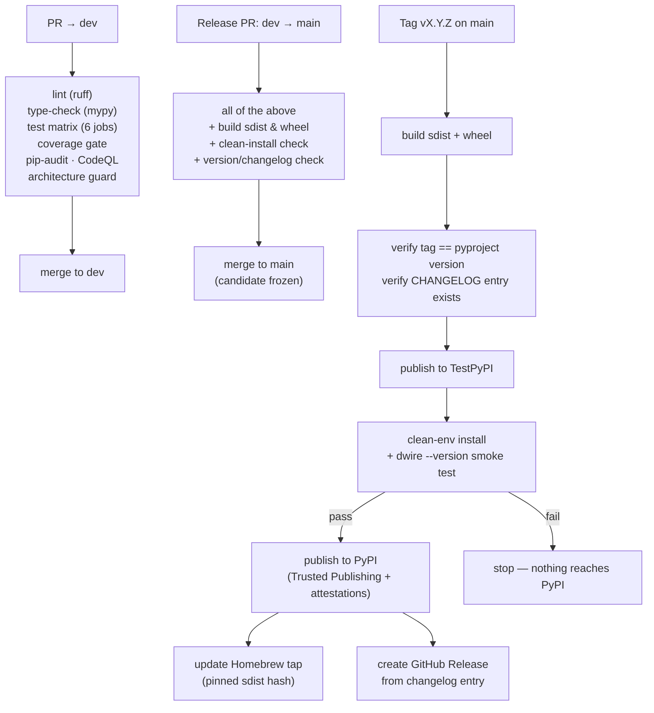

# CI/CD Pipeline Architecture

| Attribute   | Value       |
| ----------- | ----------- |
| **Project** | DevWorkWire |
| **Version** | 0.1         |
| **Status**  | Draft       |

## Table of Contents

- [1. Branching Strategy](#1-branching-strategy)
  - [Branch Protection Rules](#branch-protection-rules)
- [2. Fork Setup \& Sync](#2-fork-setup--sync)
  - [One-time Fork Setup](#one-time-fork-setup)
  - [Keeping Your Fork in Sync](#keeping-your-fork-in-sync)
- [3. Branch Naming Conventions](#3-branch-naming-conventions)
- [4. PR Conventions](#4-pr-conventions)
  - [Feature PR Flow (target: `dev`)](#feature-pr-flow-target-dev)
  - [Release PR Flow (dev → main)](#release-pr-flow-dev--main)
  - [Releasing](#releasing)
  - [Release Versioning](#release-versioning)
  - [Commit Conventions](#commit-conventions)
- [5. CI/CD Tool Selection](#5-cicd-tool-selection)
- [6. Pipeline Stages](#6-pipeline-stages)
- [7. Build and Verification Responsibilities](#7-build-and-verification-responsibilities)
  - [Feature PR Pipeline (target: `dev`)](#feature-pr-pipeline-target-dev)
  - [Security-Critical Tests](#security-critical-tests)
  - [Release PR Pipeline (target: `main`)](#release-pr-pipeline-target-main)
  - [Publish Pipeline (trigger: tag `vX.Y.Z` on `main`)](#publish-pipeline-trigger-tag-vxyz-on-main)
- [8. Hotfix Process](#8-hotfix-process)
- [9. Environment Strategy](#9-environment-strategy)
- [10. Local State Store Migration Strategy](#10-local-state-store-migration-strategy)
- [11. Rollback Strategy](#11-rollback-strategy)
- [12. Secrets and Publishing Credentials](#12-secrets-and-publishing-credentials)
- [13. Release Safety Instead of Zero-Downtime](#13-release-safety-instead-of-zero-downtime)
- [14. Deployment Impact Summary](#14-deployment-impact-summary)
- [Source References](#source-references)

## 1. Branching Strategy

The project uses a **two-branch model** (`dev` + `main`) with fork-based contributions. All
contributors — core team and external — work from forks and submit pull requests to the
upstream repository.

```
feature/<desc>  fix/<desc>  docs/<desc>    ← created from dev in your fork
         │
         ▼
        dev  ───────────────────────────── integration branch (upstream)
         │                                 PR from fork to upstream dev
         │                                 CI must pass
         │
         ▼  (PR dev → main)
        main ───────────────────────────── release branch (upstream)
         │                                 PR from upstream dev to main
         │                                 CI must pass
         │                                 merge freezes a release candidate
         │
         ▼  (tag vX.Y.Z on main)
    Published ──────────────────────────── tag triggers the publish pipeline
                                           TestPyPI → smoke test → PyPI → tap
```

**Permanent branches in the upstream repo (`alonsovndev/devworkwire`):** `dev`, `main`

- **`dev`**: Integration branch. All feature, fix, docs, refactor, test, and chore PRs
  target `dev`.
- **`main`**: Release branch. Only receives merges from `dev` (via release PR) or
  `hotfix/*` branches. A merge to `main` freezes a release candidate but publishes
  nothing. **Publication is triggered by tagging a semantic version (`vX.Y.Z`) on `main`.**

No direct commits to `dev` or `main`. All changes arrive via pull request.

### Branch Protection Rules

| Rule                    | `dev`                                            | `main`                                                      |
| ----------------------- | ------------------------------------------------ | ----------------------------------------------------------- |
| Direct pushes           | Blocked                                          | Blocked                                                     |
| PR required             | All changes via PR                               | All changes via PR from `dev` or hotfix                     |
| Required approvals      | **0** (see note)                                 | **0** (see note)                                            |
| Status checks           | Must pass (lint, type-check, test, build, audit) | Must pass (lint, type-check, test, build, audit, packaging) |
| Up-to-date before merge | Required                                         | Required                                                    |
| Conversation resolution | Required                                         | Required                                                    |
| Stale reviews           | Dismissed on new commits                         | Dismissed on new commits                                    |
| Force pushes            | Blocked                                          | Blocked                                                     |
| Tag protection          | —                                                | `v*` tags restricted to maintainers                         |

> **Note on approvals.** DevWorkWire currently has **one part-time maintainer**
> ([Role Mapping](../../02-planning/role-mapping.md)). Requiring approvals would either
> block all work or be routinely bypassed with an admin override — and a protection rule
> that is habitually overridden teaches the habit of overriding it. So the gate is
> **automated rather than social**: PRs are still mandatory, force pushes are still
> blocked, and **CI must pass to merge**.
>
> **When a second maintainer joins**, raise this to 1 approval into `dev` and 2 into
> `main`, and disallow self-approval. That is the target state, not the current one.

---

## 2. Fork Setup & Sync

### One-time Fork Setup

Fork the upstream repository on GitHub, then:

```bash
git clone git@github.com:<your-handle>/devworkwire.git
cd devworkwire
git remote add upstream git@github.com:alonsovndev/devworkwire.git
git remote -v
# origin    git@github.com:<your-handle>/devworkwire.git (fetch/push)
# upstream  git@github.com:alonsovndev/devworkwire.git (fetch/push)
```

`origin` is your fork. `upstream` is the project repo. You push to `origin` and open PRs
targeting `upstream`.

> The maintainer may branch directly in the upstream repo rather than through a fork; the
> PR requirement and CI gate apply identically either way.

### Keeping Your Fork in Sync

Sync your fork's `dev` with upstream before starting any new branch:

```bash
git fetch upstream
git checkout dev
git rebase upstream/dev
git push origin dev
```

If your feature branch diverges from `dev` while in progress:

```bash
git checkout feature/<branch-name>
git rebase upstream/dev
git push origin feature/<branch-name> --force-with-lease
```

---

## 3. Branch Naming Conventions

All work branches are created from `dev` (except hotfixes, which branch from `main`):

| Branch type   | Pattern                       | Example                             | Targets |
| ------------- | ----------------------------- | ----------------------------------- | ------- |
| Feature       | `feature/<short-description>` | `feature/jira-provider-adapter`     | `dev`   |
| Bug fix       | `fix/<issue-description>`     | `fix/drift-hash-line-endings`       | `dev`   |
| Documentation | `docs/<topic>`                | `docs/update-readme`                | `dev`   |
| Refactoring   | `refactor/<component>`        | `refactor/work-item-service`        | `dev`   |
| Tests         | `test/<scope>`                | `test/confirm-gate-regressions`     | `dev`   |
| Chores        | `chore/<task>`                | `chore/update-dependencies`         | `dev`   |
| Hotfix        | `hotfix/<description>`        | `hotfix/ncetoken-leak-in-debug-log` | `main`  |

---

## 4. PR Conventions

| Field                     | Rule                                                                                                                                      |
| ------------------------- | ----------------------------------------------------------------------------------------------------------------------------------------- |
| Title                     | Short description in imperative mood (e.g., `add jira provider adapter`)                                                                  |
| Target branch             | `dev` for features, fixes, docs, refactors, tests, chores; `main` for hotfixes                                                            |
| Merge strategy            | Standard merge commit — preserves full feature branch history                                                                             |
| Required approvals        | 0 while single-maintainer; 1 into `dev` / 1 into `main` once a second maintainer joins                                                    |
| CI gate                   | **All status checks must pass** — this is the enforcing gate                                                                              |
| Unresolved threads        | Must be resolved before merge                                                                                                             |
| Up-to-date                | Branch must be current with target before merge                                                                                           |
| Security-relevant changes | Any change touching the confirm gate, token handling, or the release workflow states so in the PR description and names the covering test |

### Feature PR Flow (target: `dev`)

```bash
# 1. Sync your fork
git fetch upstream
git checkout dev
git rebase upstream/dev
git push origin dev

# 2. Create feature branch
git checkout -b feature/<description>

# 3. Develop and commit using Conventional Commits
git commit -m "feat(scope): add feature description"

# 4. Push to your fork
git push -u origin feature/<description>

# 5. Open PR on GitHub:
#    From: <your-handle>/devworkwire:feature/<description>
#    Into: alonsovndev/devworkwire:dev
```

CI runs checks on the PR. Once all checks pass, merge via standard merge commit. Delete the
branch after merge.

### Release PR Flow (dev → main)

```bash
# Open a PR from upstream dev into upstream main
# All CI checks must pass, including the packaging check
# Merge freezes a release candidate — it does NOT publish
```

Even with no second reviewer, **read the full `dev` → `main` diff before merging**. It is
the last checkpoint before a version can be tagged, and publication cannot be undone for
already-installed copies.

### Releasing

Once the candidate is ready, bump the version, update the changelog, then tag from upstream
`main`:

```bash
git fetch upstream
git checkout main
git rebase upstream/main
git tag v1.0.0
git push upstream v1.0.0
```

The tag (`vX.Y.Z`) triggers the publish pipeline. CI **fails the release** if the tag does
not match the version in `pyproject.toml`, or if `CHANGELOG.md` has no entry for it.

### Release Versioning

The project uses semantic versioning (`vMAJOR.MINOR.PATCH`)
([FR-009-04](../../01-requirements/f-009-packaging-distribution.md)). For DevWorkWire the
"public API" is the **MCP tool surface and the CLI command surface** — see
[Interface Design Standards](../interfaces/interface-standards.md#versioning-strategy) for the full
rules.

| Segment | Increment when                                                                                                                                                                       |
| ------- | ------------------------------------------------------------------------------------------------------------------------------------------------------------------------------------ |
| `MAJOR` | Renaming/removing an MCP tool or argument, changing an argument's type or meaning, removing a result field, changing a CLI exit code's meaning, or changing what an error code means |
| `MINOR` | New tool, new optional argument, new result field, new CLI command or flag, new error code, **or any tightening of a gate**                                                          |
| `PATCH` | Bug fix, backwards-compatible                                                                                                                                                        |

Adding or tightening a gate is deliberately **never** treated as a breaking change worth
avoiding.

**Version and changelog are maintained by hand, and verified by CI.** The version is bumped
in `pyproject.toml` and the entry written in `CHANGELOG.md` following Keep a Changelog
conventions; the release workflow refuses to publish if either is missing or inconsistent
with the tag. Hand-written entries keep the changelog useful to a reader deciding whether
to upgrade — which is its actual job, and the reason it is not generated from commit
messages.

### Commit Conventions

All commits follow **Conventional Commits** (`<type>(<scope>): <description>`):

| Type       | When to use                                   |
| ---------- | --------------------------------------------- |
| `feat`     | New feature for users                         |
| `fix`      | Bug fix                                       |
| `docs`     | Documentation only                            |
| `style`    | Code formatting, whitespace (no logic change) |
| `refactor` | Code change with no functional change         |
| `test`     | Adding or updating tests                      |
| `chore`    | Build process, tooling, dependencies          |
| `perf`     | Performance improvements                      |
| `ci`       | CI/CD configuration changes                   |

Examples:

- `feat(mcp): add workitem.query tool`
- `fix(jira): preserve epic link on story update`
- `docs(adr): add local state store decision`
- `refactor(import): extract drift detection from preview builder`

**Enforcement:** PR titles are validated via CI. No local commit hooks are enforced — this
reduces developer friction during rapid iteration. `CONTRIBUTING.md` documents the format
with examples for new contributors.

---

## 5. CI/CD Tool Selection

**Selected:** GitHub Actions.

**Rationale:** the repository is on GitHub, and three decisions already made depend on it —
**PyPI Trusted Publishing** requires an OIDC identity provider that Actions provides
natively (removing the long-lived PyPI token that is the usual package-hijacking target),
and **Dependabot** and **CodeQL** are GitHub-native
([Security Architecture](../security/security-architecture.md#supply-chain-security)).
It is free for public repositories, so the CI budget constraint is maintainer attention
rather than money. Adopting a different runner would mean giving up Trusted Publishing —
a security regression that no CI feature would justify.

**Runners:** GitHub-hosted `ubuntu-latest` and `macos-latest`. No self-hosted runners — a
self-hosted runner executing PRs from forks is a well-known compromise path, and there is
nothing here that needs one.

---

## 6. Pipeline Stages



The TestPyPI stage is the one that earns its place: it is what actually enforces
[NFR-009-01](../../01-requirements/f-009-packaging-distribution.md) — a clean install with
no manual dependency fixes — **before** the artifact can reach users. A PyPI version number
can never be reused, so a failure caught here costs a re-tag; the same failure caught after
publication costs a yank and a version bump.

---

## 7. Build and Verification Responsibilities

### Feature PR Pipeline (target: `dev`)

Triggered on every PR targeting `dev`. **Publishes nothing.**

| Check                    | Tool                                                                                                                                                                                                    | Failure policy                                                                                                                         |
| ------------------------ | ------------------------------------------------------------------------------------------------------------------------------------------------------------------------------------------------------- | -------------------------------------------------------------------------------------------------------------------------------------- |
| Lint + format            | `ruff check`, `ruff format --check`                                                                                                                                                                     | Blocking                                                                                                                               |
| Security lint            | Ruff `S` (bandit-derived) ruleset                                                                                                                                                                       | Blocking                                                                                                                               |
| Type check               | `mypy` (strict on `core/` and `features/`)                                                                                                                                                              | Blocking                                                                                                                               |
| Tests                    | `pytest` on the matrix below                                                                                                                                                                            | Blocking                                                                                                                               |
| Coverage                 | `pytest-cov` — **≥80% on `WorkItemService` and provider adapters** ([NFR-X03](../../01-requirements/README.md#cross-cutting-quality-baseline))                                                          | Blocking                                                                                                                               |
| Dependency audit         | `pip-audit` — **fails on Critical/High** ([NFR-X01](../../01-requirements/README.md#cross-cutting-quality-baseline))                                                                                    | Blocking                                                                                                                               |
| SAST                     | CodeQL                                                                                                                                                                                                  | Blocking                                                                                                                               |
| Architecture guard       | No `presentation/` package — the shared hosts or a slice's own `features/*/presentation` — may import `infrastructure/`; no `features/*/application` imports another slice or performs an ungated provider write; Pydantic absent from `core/` and every `features/*/application` ([Architecture Styles](../core/architecture-styles.md#where-the-conventional-layers-live)) | Blocking                                                                                                                               |
| MCP tool schema snapshot | Generated tool schemas diffed against a committed snapshot                                                                                                                                              | Blocking — an unreviewed contract change must be deliberate ([Interface Design Standards](../interfaces/interface-standards.md#deployment-impact)) |
| Docs build               | Docusaurus build in the docs repo                                                                                                                                                                       | Blocking                                                                                                                               |

**Test matrix — 6 jobs:**

| OS              | Python           |
| --------------- | ---------------- |
| `ubuntu-latest` | 3.11, 3.12, 3.13 |
| `macos-latest`  | 3.11, 3.12, 3.13 |

Windows is not tested and not supported — see
[Deployment Architecture](./deployment-architecture.md#supported-platforms). Testing the
3.11 floor and the current release catches accidental use of a newer-only feature before
it ships.

### Security-Critical Tests

These are ordinary `pytest` tests, but they encode the product's core safety properties and
should be labeled so a future contributor does not weaken one while "simplifying" a test
suite. Each corresponds to a P1 mitigation in the
[Threat Model](../security/threat-model.md#p1--critical-must-fix-before-mvp):

- Commit without a preview handle → rejected.
- Commit without `confirmed: true` → rejected.
- Commit with an expired or mismatched handle → rejected.
- Any `*.preview` issues **zero** provider writes.
- Commit with an unresolved drifted item → rejected.
- The API token never appears in captured log output at maximum verbosity.
- The MCP server writes nothing but protocol frames to stdout.
- A source document containing prompt-injection text yields a normal plan and no
  privileged behavior.

### Release PR Pipeline (target: `main`)

Everything above, plus:

- Build `sdist` and `wheel` with Hatchling.
- Install the built wheel into a clean virtual environment and verify the `dwire` entry
  point resolves.
- Verify `pyproject.toml` version and `CHANGELOG.md` are consistent and ready to tag.

**Merging freezes a candidate. It publishes nothing.**

### Publish Pipeline (trigger: tag `vX.Y.Z` on `main`)

1. Build `sdist` and `wheel`.
2. **Verify** the tag matches the `pyproject.toml` version and that `CHANGELOG.md` has an
   entry for it — fail the release otherwise.
3. Publish to **TestPyPI**.
4. **Smoke test:** in a clean container, `pip install` from TestPyPI and run
   `dwire --version` and `dwire --help`.
5. On success, publish to **PyPI** via Trusted Publishing (OIDC), with PEP 740 attestations.
6. Update the **Homebrew tap** formula with the new version and the sdist hash.
7. Create a **GitHub Release** using the changelog entry.

No step in this pipeline touches a user's machine — publication makes an artifact
_available_; users choose when to install it.

---

## 8. Hotfix Process

Use hotfixes only for critical bugs that cannot wait for the normal `dev` → `main` cycle —
in practice, a token leak, a gate bypass, or a defect that creates duplicate or corrupted
issues in users' trackers.

1. Sync your fork's `main` with upstream, then branch from it:

   ```bash
   git fetch upstream
   git checkout main
   git rebase upstream/main
   git checkout -b hotfix/<description>
   ```

2. Fix, **add a regression test that fails without the fix**, push, and open a PR into
   upstream `main`.

3. After merge, bump the PATCH version, add the changelog entry, and tag from upstream
   `main`:

   ```bash
   git tag v1.0.1
   git push upstream v1.0.1
   ```

   The tag triggers the publish pipeline.

4. Back-merge into upstream `dev` to keep branches in sync:

   ```bash
   git fetch upstream
   git checkout dev
   git rebase upstream/dev
   git merge upstream/main
   git push upstream dev
   ```

5. **For a security fix:** yank the affected version(s) from PyPI, publish a GitHub Security
   Advisory, and update the tap. Note the hard limit — already-installed copies keep
   running; yanking only blocks new installs
   ([Security Architecture](../security/security-architecture.md#incident-response-lifecycle)).

**Recovery is always fix-forward.** There is no redeploy of a prior artifact, because
nothing is deployed.

---

## 9. Environment Strategy

There are no hosted environments. The pipeline's "environments" are verification contexts:

| Environment  | Purpose                 | Triggered by               | Notes                                                               |
| ------------ | ----------------------- | -------------------------- | ------------------------------------------------------------------- |
| Local        | Development and testing | Developer                  | `pip install -e .`; a real Jira project for manual verification     |
| CI           | Automated verification  | Every PR                   | Ephemeral runners; Linux + macOS × Python 3.11–3.13                 |
| TestPyPI     | Pre-publication gate    | Tag on `main`              | The only thing resembling staging. Proves clean install before PyPI |
| PyPI         | Public release          | Tag, after the gate passes | Irreversible                                                        |
| Homebrew tap | Public release (macOS)  | Follows the PyPI publish   | Pinned sdist hash                                                   |

**Integration testing against Jira** needs a real instance, which CI does not have.
Provider-adapter tests run against recorded/mocked HTTP responses so the suite stays
network-free and deterministic; live verification against a real Jira project is a manual
pre-release step. This is a genuine coverage gap — a Jira API change would not be caught by
CI — and it should be listed as a release-checklist item rather than assumed away.

---

## 10. Local State Store Migration Strategy

There is no server database and no operator: the "DBA" is a developer running `dwire` who
does not know the state store exists.

- **Migrations run in-process on store open**, not from the pipeline. There is no migration
  command for a user to run and no deploy step to hook.
- Versioned, ordered migration steps applied in a single transaction, tracked in
  `schema_version` ([Database Design](../database/database-design.md)).
- **Additive-first**: new columns nullable or defaulted; no in-place renames or retypes.
- A store **newer** than the running binary (after a user downgrades) is refused with a
  clear message rather than misread.
- **The rebuild escape hatch:** because the store is a rebuildable cache, a change that
  would otherwise be breaking may drop and rebuild the index from Jira instead of shipping
  an elaborate data migration. Use it.
- **CI must test migrations forward from every released schema version.** A user upgrading
  from an old version is the normal case — they upgrade on their own schedule, and may skip
  many versions.

---

## 11. Rollback Strategy

| Layer                 | Strategy                                                                                                                                                                |
| --------------------- | ----------------------------------------------------------------------------------------------------------------------------------------------------------------------- |
| **Published release** | **Fix-forward only.** Yank the bad version to block new installs, publish a patched version, update the tap. Already-installed copies keep running — there is no recall |
| **User-side**         | `pipx install devworkwire==<previous>` / `pip install devworkwire==<previous>`. Works only because every release stays on PyPI and the changelog explains what changed  |
| **Local state store** | No down-migrations. The store is rebuildable from Jira, which is the recovery path. A store newer than the binary is refused rather than downgraded                     |
| **Repository**        | Revert the merge commit on `dev` or `main`, then release a new patch version                                                                                            |
| **Homebrew tap**      | Revert the formula commit to point at the previous pinned version                                                                                                       |

A version number is **never reused**. A broken `1.2.0` is followed by `1.2.1`.

---

## 12. Secrets and Publishing Credentials

| Secret              | Where                                                                        | Notes                                                                                                                                    |
| ------------------- | ---------------------------------------------------------------------------- | ---------------------------------------------------------------------------------------------------------------------------------------- |
| PyPI publishing     | **None exists.** Trusted Publishing via short-lived OIDC from GitHub Actions | Removes the long-lived PyPI API token that is the standard package-hijacking target (T-005, [Threat Model](../security/threat-model.md)) |
| TestPyPI publishing | Trusted Publishing, same mechanism                                           |                                                                                                                                          |
| Homebrew tap push   | GitHub Actions secret, scoped to the tap repository only                     | Least-privilege: it can update the formula and nothing else                                                                              |
| Jira API token      | **Never in CI.** CI runs no live Jira calls                                  | Users supply their own at run time ([FR-008-02](../../01-requirements/f-008-provider-auth-configuration.md))                             |

- Publishing workflows run **only** on tag events from `main`, in a GitHub Actions
  environment restricted to that trigger.
- No plaintext secret is ever committed. GitHub secret scanning with push protection is
  enabled.
- Workflow permissions are minimal by default, with `id-token: write` granted only to the
  publishing job.
- Third-party actions are pinned to a commit SHA, not a mutable tag — a moving tag on a
  third-party action is a supply-chain hole in the pipeline that protects the supply chain.

---

## 13. Release Safety Instead of Zero-Downtime

Zero-downtime deployment does not apply: nothing is running to interrupt, and there is no
rolling replacement or health check
([Deployment Architecture](./deployment-architecture.md)). The analogous concern for
distributed software is **release safety** — a bad release cannot be pulled back from
machines that already have it.

The controls that substitute for a safe rollout:

- **The TestPyPI clean-install gate** — a broken package cannot reach PyPI.
- **A 6-job matrix** covering both supported OSes and the Python floor through current.
- **Security-critical gate tests** that must pass before any merge.
- **Attestations and Trusted Publishing** so the artifact is verifiably built from tagged
  source.
- **Backwards-compatible state-store migrations**, tested forward from every released
  version, so upgrading never strands a user's local state.
- **A changelog written for a human deciding whether to upgrade**, since that decision is
  the only rollout control that exists.

---

## 14. Deployment Impact Summary

- The pipeline separates integration (`dev`) from release (`main`), and **publication is
  triggered only by a tag** — merging never publishes.
- **The gate is automated, not social.** With one maintainer, CI status checks are the
  enforcing mechanism; approval counts rise when a second maintainer joins.
- **Verification is front-loaded because publication is irreversible.** The TestPyPI
  smoke test exists specifically to satisfy
  [NFR-009-01](../../01-requirements/f-009-packaging-distribution.md) before users can
  reach the artifact.
- **No long-lived publishing credential exists**, which removes the most commonly exploited
  path to shipping a malicious release.
- **There is no post-release telemetry**, by design — so a bad release is detected by users
  reporting it, which is why pre-release gates carry the weight and why `SECURITY.md` and
  issue reporting must be easy to find.
- **Live Jira verification remains a manual pre-release step**, and is a known CI coverage
  gap rather than a solved problem.

## Source References

- [Deployment Architecture](./deployment-architecture.md)
- [Monitoring and Observability](./monitoring-observability.md)
- [Security Architecture](../security/security-architecture.md)
- [Threat Model](../security/threat-model.md)
- [Interface Design Standards](../interfaces/interface-standards.md)
- [Database Design](../database/database-design.md)
- [F-009 Packaging & Distribution](../../01-requirements/f-009-packaging-distribution.md)
- [ADR Decision Log](../../04-decisions/README.md)

---

**Last Updated**: 2026-09-01
