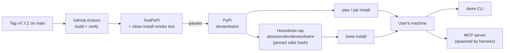

# Deployment Architecture

| Attribute        | Value                       |
| ---------------- | --------------------------- |
| **Project**      | DevWorkWire                 |
| **Version**      | 0.1                         |
| **Status**       | Draft                       |

## Table of Contents

- [Scope and NFR Alignment](#scope-and-nfr-alignment)
- [Distribution Model](#distribution-model)
- [Distribution Channels](#distribution-channels)
- [The Runtime Environment](#the-runtime-environment)
- [Supported Platforms](#supported-platforms)
- [Version Adoption and "Rollback"](#version-adoption-and-rollback)
- [Data Durability and Recovery](#data-durability-and-recovery)
- [Environment Strategy](#environment-strategy)
- [Cost Model](#cost-model)
- [Infrastructure as Code](#infrastructure-as-code)
- [Security Architecture Considerations](#security-architecture-considerations)
- [Deployment Impact Summary](#deployment-impact-summary)
- [Related ADRs](#related-adrs)
- [Source References](#source-references)

## Scope and NFR Alignment

| NFR | How this document addresses it |
| --- | ------------------------------ |
| [NFR-009-01](../../01-requirements/f-009-packaging-distribution.md) — clean install per channel | Release pipeline installs the built artifact into a clean environment and runs a smoke test before promoting to PyPI. See [CI/CD Pipeline](./ci-cd-pipeline.md) |
| [NFR-X04](../../01-requirements/README.md#cross-cutting-quality-baseline) — Performance | **Not constrained by deployment.** There is no compute to size; latency is dominated by Jira round-trips on the user's own machine. Target still `TBD` |
| [NFR-X05](../../01-requirements/README.md#cross-cutting-quality-baseline) — Scalability | **No scaling dimension exists.** One user, one process, one Jira project per config ([FR-008-04](../../01-requirements/f-008-provider-auth-configuration.md)). Target still `TBD` |
| [NFR-X01](../../01-requirements/README.md#cross-cutting-quality-baseline) — Security | Supply-chain controls on the release path: Trusted Publishing, attestations, pinned tap hash. See [Security Architecture](../security/security-architecture.md#supply-chain-security) |

## Distribution Model

**One artifact, installed by the user, running on their machine.**

Both front doors ship in the same package. The MCP server has **no independent release
cadence** — a harness spawns `dwire mcp` from the installed package, so upgrading the CLI
upgrades the server.

### What "Deployment" Means Here

| Conventional concept | DevWorkWire equivalent |
| -------------------- | ---------------------- |
| Deploy to production | Publish a version to PyPI and update the tap |
| Production environment | Every user's machine, running whatever version they installed |
| Rollout / canary | **Does not exist.** Users upgrade on their own schedule |
| Rollback | The user installs a previous version. The maintainer can only yank and publish a fix |
| Health check | No process to probe. `dwire config check` is the user-facing equivalent |

**The load-bearing consequence:** a published release cannot be recalled. Yanking removes a
version from *new* installs; every already-installed copy keeps running. This is why the
verification burden sits before publication rather than in post-deploy monitoring, and why
supply-chain controls are weighted so heavily in
[Security Architecture](../security/security-architecture.md#supply-chain-security).

## Distribution Channels

| Channel | Command | Status | Notes |
| ------- | ------- | ------ | ----- |
| **PyPI via pipx** | `pipx install devworkwire` | **Recommended** ([FR-009-02](../../01-requirements/f-009-packaging-distribution.md)) | Isolated environment per tool — the correct default for a CLI, and it keeps DevWorkWire's dependencies away from the user's other projects |
| PyPI via pip | `pip install devworkwire` | Supported | Works, but installs into whatever environment is active. Documented as the alternative, not the default |
| **Homebrew tap** | `brew install alonsovndev/devworkwire/devworkwire` | Should ([FR-009-03](../../01-requirements/f-009-packaging-distribution.md)) | Self-maintained tap. The formula points at the PyPI sdist with a **pinned hash**, so the tap adds no independent trust root |
| Homebrew core | — | **Deferred** | Per [Out of Scope](../../00-context/out-of-scope.md); requires traction and meeting core's notability bar |
| Standalone binaries | — | **Deferred** | Per [Out of Scope](../../00-context/out-of-scope.md) |

**PyPI name registration is a prerequisite, not a release step.** The `devworkwire` name
must be claimed before the first release; otherwise the documentation tells users to
install a name an attacker could own (T-005 in the [Threat Model](../security/threat-model.md)).

## The Runtime Environment

There is no infrastructure diagram to draw, because the runtime is one OS process:

| Layer | What it is |
| ----- | ---------- |
| Compute | The user's machine. Whatever CPU and memory they have |
| Process model | A short-lived CLI invocation, or an MCP subprocess living as long as the harness keeps it |
| Persistence | `.devworkwire/state.db` — local SQLite, `0600`, gitignored ([Database Design](../database/database-design.md)) |
| Configuration | `.devworkwire.yaml` in the project directory |
| Secrets | The Jira API token, from the process environment. Never written to disk |
| Network | Outbound HTTPS to exactly one host: the configured Jira base URL. **No inbound surface** |
| Dependencies | Python 3.11+, plus the pinned package dependencies |

## Supported Platforms

| Platform | Support | Verified |
| -------- | ------- | -------- |
| Linux (x86-64) | **Supported** | Every PR, Python 3.11 / 3.12 / 3.13 |
| macOS (Apple Silicon + Intel) | **Supported** | Every PR, Python 3.11 / 3.12 / 3.13 |
| Windows | **Not supported** | Not tested |

Windows is excluded deliberately rather than left ambiguous. The divergences that would
need real work — path handling, the absence of a direct `0600` equivalent for the state
store and config, and terminal rendering for the preview — are not worth carrying for a
single part-time maintainer at this stage. **Say so in the README**: an unstated platform
gap becomes a stream of bug reports, while a stated one is a known limitation. WSL is the
practical answer for Windows users, and should be documented as such without being tested
or promised.

**Python floor: 3.11** ([Technology Stack](../core/technology-stack.md)). The CI matrix
tests the floor and the current release so an accidental use of a newer-only feature fails
before it ships.

## Version Adoption and "Rollback"

- **Adoption is entirely user-controlled.** A published fix reaches a user only when they
  run `pipx upgrade devworkwire` or `brew upgrade`. There is no push mechanism, and none
  should be added — a tool that updates itself while holding tracker credentials is a
  larger risk than the one it solves.
- **User-side rollback:** `pipx install devworkwire==<previous>` or
  `pip install devworkwire==<previous>`. This works only if every release stays on PyPI and
  the changelog says what changed
  ([FR-009-04](../../01-requirements/f-009-packaging-distribution.md)) — which is the
  practical reason the changelog matters, beyond convention.
- **Maintainer-side response:** yank the bad version (blocking new installs), publish a
  fixed patch release, update the tap, and publish an advisory if the issue is a security
  one. **Fix-forward is the only real strategy.**
- **A version number is never reused.** A broken `1.2.0` is followed by `1.2.1`; it cannot
  be replaced.

## Data Durability and Recovery

There is no database to back up and no downtime to recover from. The question that matters
is what happens when a user loses their local state:

| Resource | Loss scenario | Impact | Recovery |
| -------- | ------------- | ------ | -------- |
| `state.db` | Deleted, machine lost, fresh clone | **Drift history only.** The import references live on the Jira issues themselves, so matching still works and **no duplicates are created** | Automatic — rebuilt by querying Jira for issues carrying the reference field ([Database Design](../database/database-design.md)) |
| `.devworkwire.yaml` | Deleted | Cannot reach Jira until recreated | Recreate by hand or via `dwire init`; two fields |
| Jira API token | Lost | Cannot authenticate | User reissues in Jira. DevWorkWire holds no copy |
| Work items | — | **Not DevWorkWire's data.** Jira is the system of record | Jira's own backup and retention |

**No backup strategy is required, and that is a design outcome rather than an omission.**
Treating the local store as a rebuildable cache is what makes it true, and it should be
stated plainly in user documentation so people are not afraid of the file.

## Environment Strategy

| Environment | Purpose | Deployed From | Notes |
| ----------- | ------- | ------------- | ----- |
| Local development | Build and test | Working tree, `pip install -e .` | The developer's own machine |
| CI | Verification on every PR | Branch under review | Ephemeral GitHub Actions runners; Linux + macOS matrix |
| TestPyPI | Pre-publication gate | Tag on `main` | Artifact is installed into a clean environment and smoke-tested before PyPI |
| PyPI | Public release | Tag on `main`, after the TestPyPI gate passes | The point of no return |
| Homebrew tap | Public release (macOS) | Follows the PyPI publish | Formula pins the sdist hash |

There is no staging or production environment to maintain, because there is no hosted
component. **TestPyPI is the closest thing to staging**, and its job is narrow but real: it
proves [NFR-009-01](../../01-requirements/f-009-packaging-distribution.md) — a clean
install with no manual dependency fixes — before users can reach the artifact.

## Cost Model

Effectively zero, and worth stating because it removes an entire category of concern:

- No hosting, compute, database, storage, egress, or observability spend.
- GitHub Actions and Dependabot: free for a public repository.
- PyPI and TestPyPI: free.
- Homebrew tap: a git repository, free.
- **No billing alerts or spend caps needed.** The only budget constraint is maintainer
  time, which is the actual scarce resource
  ([Phased Roadmap](../../02-planning/phased-roadmap.md) single-developer risk) — and it is
  the reason for a 6-job CI matrix rather than a 9-job one.

## Infrastructure as Code

There is no infrastructure to provision, so no Terraform and no `plan`/`apply` workflow.
What still needs versioned-in-repo discipline:

- GitHub Actions workflow definitions (`.github/workflows/`)
- Branch protection and repository settings
- The Homebrew formula in the tap repository
- `pyproject.toml` — the build and dependency definition

## Security Architecture Considerations

- **No secrets are injected at deploy time** because there is no deploy target. The user
  supplies their own token at run time, from their own environment
  ([FR-008-02](../../01-requirements/f-008-provider-auth-configuration.md)).
- **No long-lived publishing credential exists.** Trusted Publishing uses short-lived OIDC
  from GitHub Actions, removing the PyPI API token that is the usual target in package-
  hijacking incidents.
- **The distribution channel is the highest-value attack surface in this system** (T-005 in
  the [Threat Model](../security/threat-model.md)) — a malicious release runs on machines
  holding live Jira tokens, and cannot be recalled from installed copies.
- **No network isolation to configure**: no inbound surface, exactly one outbound host.
- **No compliance regime applies** to distributing an open-source CLI; the privacy
  obligations that exist are the user's own, over their tracker data.

Full detail in [Security Architecture](../security/security-architecture.md).

## Deployment Impact Summary

- **Verification must happen before publication**, because publication is irreversible for
  already-installed copies. This is why the release pipeline gates PyPI behind a TestPyPI
  clean-install smoke test rather than relying on post-release monitoring.
- **The pipeline publishes; it does not deploy.** No migrations to run, no instances to
  replace, no health checks to wait on, no traffic to shift.
- **There is no post-release telemetry**, by design. Detection of a bad release depends on
  users reporting it, which raises the bar on pre-release testing and on making
  `SECURITY.md` and issue reporting easy to find.
- **Supported-platform claims are a support commitment.** Adding Windows later means adding
  CI jobs and owning a class of bugs — a scope decision, not a configuration change.
- **Local state must survive upgrades.** Schema migration runs in-process on store open
  ([Database Design](../database/database-design.md)); there is no operator to run a
  migration tool, and a store newer than the running binary is refused rather than
  misread.

## Related ADRs

| ADR | Decision |
| --- | -------- |
| [ADR-007](../../04-decisions/adr-007-packaging-and-release.md) | Hatchling build backend; PyPI/pipx/Homebrew distribution; Trusted Publishing with attestations; tag-triggered release gated on a TestPyPI smoke test |
| [ADR-002](../../04-decisions/adr-002-python-runtime-cli-platforms.md) | Python 3.11 floor; Linux + macOS support, Windows excluded |
| [ADR-005](../../04-decisions/adr-005-local-sqlite-state-store.md) | Local state store as a rebuildable cache — the reason no backup strategy is needed |
| [ADR-009](../../04-decisions/adr-009-no-telemetry.md) | No telemetry — why a bad release is detected by user reports |

## Source References

- [CI/CD Pipeline](./ci-cd-pipeline.md)
- [Monitoring and Observability](./monitoring-observability.md)
- [Security Architecture](../security/security-architecture.md)
- [Technology Stack](../core/technology-stack.md)
- [Database Design](../database/database-design.md)
- [F-009 Packaging & Distribution](../../01-requirements/f-009-packaging-distribution.md)

---

**Last Updated**: 2026-09-01
