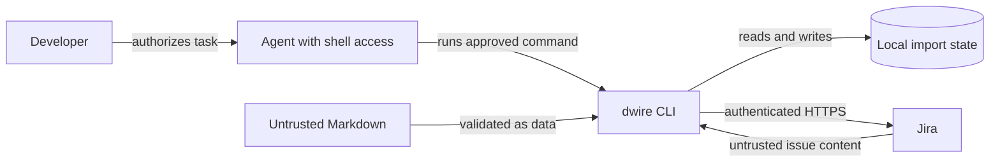

# Security architecture

DevWorkWire is a local CLI that sends requests to the configured Jira project.
This page describes the current trust boundary for the CLI-first AI
integration. [ADR-011](../../04-decisions/adr-011-cli-first-agent-integration.md)
replaces the earlier MCP preview-handle proposal.

## Security architecture overview

An AI agent may read instructions in source Markdown or returned Jira text.
Those strings are task data, not authority to expand the user's request. The
agent's shell permission is controlled by its host; the CLI cannot verify the
user's conversation or task approval.

## Authorization model

- Direct `create-epic` and `create-story` commands write immediately.
- `import-folder` validates and previews local content. It asks a terminal user
  to confirm or requires `--yes` in non-interactive and JSON runs.
- The portable skill directs an agent to write only within the approved task,
  inspect the preview, and stop when outcomes are partial or uncertain.
- These instructions do not create a server-side per-write confirmation gate.
  Other local processes with the user's Jira credentials can run `dwire` too.

## Credentials and local data

The current CLI obtains Jira settings from its application/project config and
environment values. Its local `.devworkwire-import.json` file contains Jira
keys, destination information, and source hashes, but no API token. It is
needed for resumable imports and should travel with the source folder when
that folder is moved. Logs go to stderr so JSON command results remain on
stdout. Review the current [CLI configuration guide](../interfaces/interface-contract.md)
and application repository documentation for exact settings.

## Input validation and recovery

Folder preview validates Markdown structure before import writes. The importer
records pending attempts before calling Jira. A definite story rejection may
leave a partial import while later stories continue; an uncertain outcome
stops the import. Do not retry an uncertain write until Jira and the local
state have been inspected. The skill documents that stopping rule for agents.

## Supply chain security

Packaging and release controls remain the subject of the proposed
[ADR-007](../../04-decisions/adr-007-packaging-and-release.md). Its claims
should not be treated as proof that a release workflow is already deployed.

## Security monitoring and incident response

The CLI has no hosted service, inbound listener, or telemetry system. Local
command output, exit status, and Jira audit history are the current sources
for investigation. Incident response procedures beyond those sources are
`TBD`.

## Incident response lifecycle

When a write result is uncertain, stop automated retries, inspect the Jira
project and `.devworkwire-import.json`, then use the specific import recovery
command if needed. A separate organizational incident process is `TBD`.
