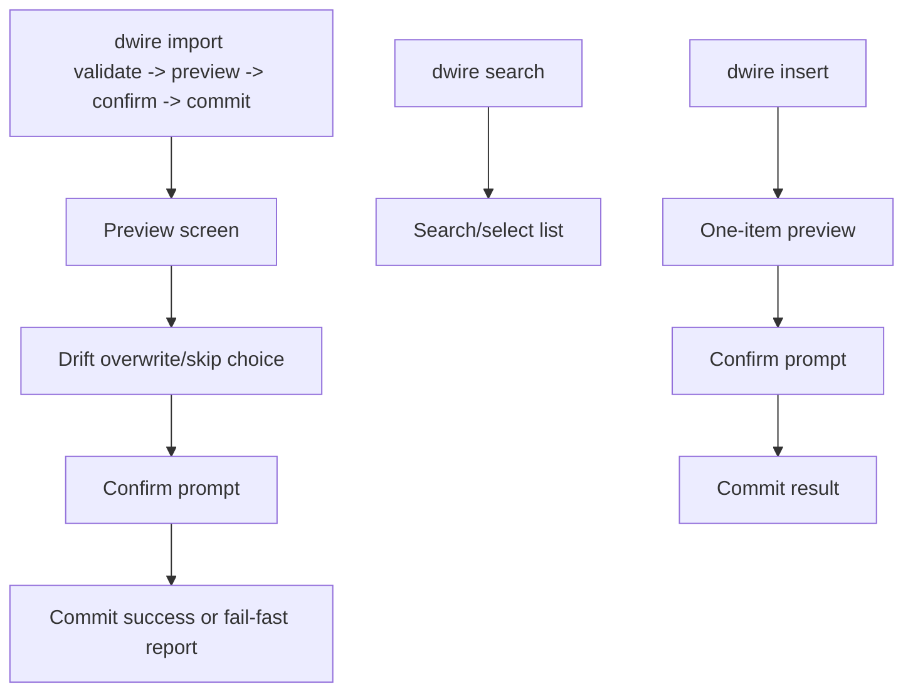

# Prototype Brief

| Attribute   | Value       |
| ----------- | ----------- |
| **Project** | DevWorkWire |
| **Version** | 0.1         |
| **Status**  | Accepted    |

## Table of Contents

- [Purpose](#purpose)
- [Product Context](#product-context)
- [Goals](#goals)
- [Success Criteria](#success-criteria)
- [Target Users](#target-users)
- [MVP Prototype Scope](#mvp-prototype-scope)
  - [In Scope](#in-scope)
  - [Out of Scope](#out-of-scope)
- [Screens](#screens)
- [Information Architecture](#information-architecture)
  - [Sitemap](#sitemap)
  - [Navigation Model](#navigation-model)
- [Key User Flows](#key-user-flows)
- [Assumptions](#assumptions)
- [Requirements Coverage Matrix](#requirements-coverage-matrix)
- [Source References](#source-references)

## Purpose

DevWorkWire has no GUI — it is the `dwire` CLI plus an MCP server with no visual surface
of its own — so this prototype validates the guided terminal UX rather than a visual
design. Each screen below is an illustrative terminal transcript showing what a
Rich-rendered `dwire import` session communicates at each step, not a literal
pixel-accurate render. There is no `.pen` design file for this prototype.

## Product Context

DevWorkWire takes an already-refined Epic, with its Stories and Acceptance Criteria, from
a folder holding `epic.md` and `stories.md`, and loads it into Jira through a guided
`dwire import <folder>` flow: validate, preview, confirm, commit. Because every write is
gated behind a single yes/no confirmation, the terminal
output at each step is the entire user experience — if the preview, drift, or fail-fast
states are unclear in the terminal, the confirm gate itself becomes untrustworthy. This
prototype exists to catch that class of problem before implementation.

## Goals

- Confirm the preview screen distinguishes create, update, and drifted items at a glance
  ([FR-001-03](../01-requirements/f-001-validate-preview-commit.md), [FR-002-03](../01-requirements/f-002-dedup-on-rerun.md)).
- Confirm the confirm-gate prompt is unambiguous about what will be written before any
  write occurs ([FR-001-04](../01-requirements/f-001-validate-preview-commit.md)).
- Confirm fail-fast partial-commit output clearly separates committed, failed, and
  not-tried items ([FR-001-06](../01-requirements/f-001-validate-preview-commit.md)).

## Success Criteria

- Preview output stays readable in an 80-column terminal for a representative folder
  (1 Epic / 20 Stories), per [NFR-003-01](../01-requirements/f-003-cli-dwire-flow.md).
- No state (create/update/drift/error) is signaled by color alone — every state below
  pairs a color with a text prefix, per NFR-X06 in the
  [cross-cutting quality baseline](../01-requirements/README.md#cross-cutting-quality-baseline).
- Stakeholder walkthrough of the screens below surfaces no "what does this mean" or
  "what will this do" questions before implementation starts.

## Target Users

| Persona   | Name  | Role                                                        | Notes                                                                                                                                                                                                                               |
| --------- | ----- | ----------------------------------------------------------- | ----------------------------------------------------------------------------------------------------------------------------------------------------------------------------------------------------------------------------------- |
| Primary   | Maya  | Solo/small-team developer running `dwire` from the terminal | Covered by every screen below. See [User Personas](../00-context/user-personas.md#persona-1-solosmall-team-developer-primary).                                                                                                      |
| Secondary | Idris | Developer directing an AI agent via the MCP server          | Not covered — the MCP server has no visual surface of its own. A future pass could add `import.preview` / `import.commit` JSON tool-call examples if that's ever needed; see [F-004](../01-requirements/f-004-mcp-tool-surface.md). |

## MVP Prototype Scope

### In Scope

- Guided `dwire import <folder>` flow (a folder containing `epic.md` and `stories.md`
  for one Epic): validation failure, preview (create/update/drift), per-item drift
  overwrite-or-skip choice, confirm prompt, commit success, and fail-fast partial commit.
- Search/select of existing Jira work items, by search term or by assignee username
  ([FR-003-04](../01-requirements/f-003-cli-dwire-flow.md)).
- Insert-by-id of a single tracked item ([FR-003-05](../01-requirements/f-003-cli-dwire-flow.md), [F-005](../01-requirements/f-005-work-item-crud.md)).

### Out of Scope

- MCP tool surface and any agent-facing JSON transcripts ([F-004](../01-requirements/f-004-mcp-tool-surface.md)) — no visual/terminal surface of its own.
- Progress reporting: comments, status transitions, PR references ([F-007](../01-requirements/f-007-progress-reporting.md)).
- Non-Jira providers ([Out of Scope for MVP](../00-context/out-of-scope.md#additional-providers-phase-3)).
- Any GUI or dashboard — none is planned for DevWorkWire.

## Screens

Each screen is a terminal state Maya can reach during a `dwire` session, importing the
sample folder `data/EPIC-3-payments/` (`epic.md` for the "Payments" Epic, `stories.md`
with its Stories grouped under role headings, per [FR-001-01](../01-requirements/f-001-validate-preview-commit.md)).
Transcripts use a 1-Epic / 4-Story slice for readability here; the readability target
itself is the 1-Epic / 20-Story folder from NFR-003-01.

### 1. Import — Validation Failed

State coverage: error.

```text
$ dwire import data/EPIC-3-payments/

Validating data/EPIC-3-payments/ ...

ERROR  epic.md declares 5 stories but stories.md contains 4
ERROR  stories.md: Story "Configure payment retry policy" (Backend Engineer) is missing required field: Effort Estimate
ERROR  stories.md: Story "Send payment confirmation email" (Frontend Engineer) has an Acceptance Criteria checklist but no "As a / I want to / So that" statement

3 errors found. Fix the reported file(s) and re-run `dwire import data/EPIC-3-payments/`.
No preview generated. No changes written to Jira.
```

Covers [FR-003-02](../01-requirements/f-003-cli-dwire-flow.md), [FR-001-02](../01-requirements/f-001-validate-preview-commit.md).

### 2. Import — Preview

State coverage: populated, with create/update/drift rows in the same table.

```text
$ dwire import data/EPIC-3-payments/

Validating data/EPIC-3-payments/ ... OK (0 errors)

Preview  data/EPIC-3-payments/ -> devworkwire-jira (project: DWW)

  Action    Type    Item                              Ref
  ------    ----    --------------------------------  -----------------
  UPDATE    Epic    Payments                           DWW-100 -> matched
  CREATE    Story   Add OAuth login                    DWW-202 (new)
  UPDATE    Story   Refresh token rotation              DWW-150 -> matched
  CREATE    Story   Send payment confirmation email     DWW-203 (new)
  UPDATE    Story   Configure payment retry policy      DWW-140 -> matched (drift)

5 items: 2 create, 3 update (1 with drift)
```

Covers [FR-001-03](../01-requirements/f-001-validate-preview-commit.md), [FR-002-03](../01-requirements/f-002-dedup-on-rerun.md), [NFR-003-01](../01-requirements/f-003-cli-dwire-flow.md).

### 3. Import — Drift Overwrite/Skip Choice

State coverage: interactive choice, one per drifted item.

```text
Item DWW-140 "Configure payment retry policy" changed in Jira since last import (status: To Do -> In Progress).

  Overwrite with source folder value, or skip this item?

> Overwrite (apply source value; the tracker's manual edit is replaced)
  Skip (leave DWW-140 untouched; the rest of the batch still proceeds)

[Use arrow keys to move, Enter to select]
```

Covers [FR-002-04](../01-requirements/f-002-dedup-on-rerun.md).

### 4. Import — Confirm Prompt

State coverage: single yes/no gate, summarizing the resolved batch (after drift choices).

```text
Ready to write 5 items to Jira (2 create, 2 update, 1 overwrite). This cannot be undone from within dwire.

Proceed? [y/N]:
```

Covers [FR-001-04](../01-requirements/f-001-validate-preview-commit.md), [FR-003-03](../01-requirements/f-003-cli-dwire-flow.md).

### 5. Import — Commit Success

State coverage: populated, all items succeeded.

```text
Committing 5 items to devworkwire-jira ...

OK  DWW-100  Payments                          updated
OK  DWW-202  Add OAuth login                   created
OK  DWW-150  Refresh token rotation            updated
OK  DWW-203  Send payment confirmation email   created
OK  DWW-140  Configure payment retry policy    updated (overwritten)

5 of 5 items committed. 0 skipped, 0 failed.
```

Covers [FR-001-05](../01-requirements/f-001-validate-preview-commit.md).

### 6. Import — Commit Fail-Fast Partial Failure

State coverage: error mid-batch, with committed/failed/not-tried clearly separated.

```text
Committing 5 items to devworkwire-jira ...

OK     DWW-100  Payments                updated
OK     DWW-202  Add OAuth login         created
ERROR  DWW-150  Refresh token rotation  failed: Jira API returned 403 (insufficient permissions on field "Story Points")

Stopped after failure. 2 of 5 items committed before the error.

  Committed : DWW-100, DWW-202
  Failed    : DWW-150 (see error above)
  Not tried : DWW-203, DWW-140

Fix the reported issue and re-run `dwire import data/EPIC-3-payments/` — already-committed
items will be matched and skipped, not duplicated.
```

Covers [FR-001-06](../01-requirements/f-001-validate-preview-commit.md).

### 7. Search/Select Existing Item

State coverage: populated list, filterable.

```text
$ dwire search "onboarding"

Searching devworkwire-jira for "onboarding" ...

> DWW-160  Epic   Onboarding              In Progress
  DWW-161  Story  Collect profile info    To Do
  DWW-162  Story  Send welcome email      Done

[Type to filter, arrow keys to move, Enter to select]

Selected: DWW-160 "Onboarding"

  ID       DWW-160
  Type     Epic
  Status   In Progress
  Parent   -
```

Covers [FR-003-04](../01-requirements/f-003-cli-dwire-flow.md).

### 8. Search by Username

State coverage: populated list, filtered by assignee.

```text
$ dwire search --assignee mchen

Searching devworkwire-jira for items assigned to "mchen" ...

> DWW-150  Story  Refresh token rotation   In Progress
  DWW-202  Story  Add OAuth login          To Do
  DWW-172  Bug    Fix session timeout      To Do

[Type to filter, arrow keys to move, Enter to select]

Selected: DWW-150 "Refresh token rotation"

  ID        DWW-150
  Type      Story
  Status    In Progress
  Assignee  mchen
  Parent    DWW-100 (Payments)
```

Covers [FR-003-04](../01-requirements/f-003-cli-dwire-flow.md).

### 9. Insert-by-ID

State coverage: one-item preview + confirm + commit, reusing the same mechanism as screens 2 and 4.

```text
$ dwire insert US-EP3-BE-004

Loading item "US-EP3-BE-004" from tracked source (data/EPIC-3-payments/stories.md) ...

Preview  US-EP3-BE-004 -> devworkwire-jira

  Action    Type    Item                             Ref
  ------    ----    -------------------------------  -----------
  CREATE    Story   Add payment retry notification   DWW-205 (new)

1 item: 1 create

Proceed? [y/N]: y

Committing 1 item to devworkwire-jira ...

OK  DWW-205  Add payment retry notification  created

1 of 1 items committed.
```

Covers [FR-003-05](../01-requirements/f-003-cli-dwire-flow.md), [FR-005-02](../01-requirements/f-005-work-item-crud.md), [FR-005-03](../01-requirements/f-005-work-item-crud.md).

## Information Architecture

### Sitemap



### Navigation Model

- Command-driven: there is no persistent navigation chrome. Each command
  (`dwire import`, `dwire search`, `dwire insert`) is its own entry point.
- Within `dwire import`, the flow is strictly linear (validate → preview → drift choices
  → confirm → commit); there's no back-navigation once a step completes.

## Key User Flows

### Flow 1: Guided import with drift and fail-fast branches

1. Maya runs `dwire import data/EPIC-3-payments/` (screen 1: fails if validation errors
   exist, flow stops here).
2. Validation passes; the preview renders create/update/drift rows (screen 2).
3. For each drifted item, Maya chooses overwrite or skip (screen 3).
4. Maya confirms the resolved batch (screen 4).
5. Either every item commits (screen 5), or a write fails partway and the fail-fast
   report separates committed/failed/not-tried items (screen 6).

### Flow 2: Search and select an existing item

1. Maya runs `dwire search "onboarding"`, or narrows to a teammate's work with
   `dwire search --assignee mchen` (screen 8).
2. The filterable list renders matching items (screen 7, or screen 8 for the
   by-username variant).
3. Maya selects one and sees its current fields.

### Flow 3: Insert a single tracked item by id

1. Maya runs `dwire insert US-EP3-BE-004` for an item already tracked from a prior
   import.
2. A one-item preview renders (screen 9), followed by the same confirm gate and commit
   result as the full import flow.

## Assumptions

- Terminal transcripts are illustrative text, not literal Rich-library output — exact
  spacing/coloring is an implementation detail, not a prototype requirement.
- Placeholder data only (`DWW-*` issue keys, `data/EPIC-3-payments/` sample folder); no
  real API integration.
- The 1-Epic / 20-Story scale from NFR-003-01 is the actual readability target; the
  transcripts above use a smaller slice for brevity.
- One folder always maps to exactly one Epic ([FR-003-01](../01-requirements/f-003-cli-dwire-flow.md));
  importing several Epics means running `dwire import <folder>` once per folder, not a
  single multi-Epic batch.
- Transcripts show the resulting item list, not the raw Markdown; `stories.md`'s H2 role
  groupings are organizational only and never appear as items in the preview or commit
  output ([FR-001-01](../01-requirements/f-001-validate-preview-commit.md)).

## Requirements Coverage Matrix

| Screen/Flow                             | Covers FR(s)                    | Covers NFR(s) | Milestone |
| --------------------------------------- | ------------------------------- | ------------- | --------- |
| 1. Import — Validation Failed           | FR-003-02, FR-001-02            | —             | MVP       |
| 2. Import — Preview                     | FR-001-03, FR-002-03            | NFR-003-01    | MVP       |
| 3. Import — Drift Overwrite/Skip Choice | FR-002-04                       | —             | MVP       |
| 4. Import — Confirm Prompt              | FR-001-04, FR-003-03            | —             | MVP       |
| 5. Import — Commit Success              | FR-001-05                       | —             | MVP       |
| 6. Import — Commit Fail-Fast            | FR-001-06                       | —             | MVP       |
| 7. Search/Select Existing Item          | FR-003-04                       | —             | MVP       |
| 8. Search by Username                   | FR-003-04                       | —             | MVP       |
| 9. Insert-by-ID                         | FR-003-05, FR-005-02, FR-005-03 | —             | MVP       |

## Source References

- [Project Overview](../00-context/overview.md)
- [User Personas](../00-context/user-personas.md)
- [Requirements by Feature](../01-requirements/README.md)
- [Architecture](../03-architecture/README.md)
- [Design Direction](./design-direction.md)

---

**Last Updated**: 2026-09-03
